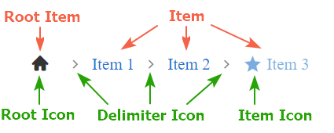

# Structure

The structure of the **RadBreadcrumb** control is as follows:

The Breadcrumb consists of items separated by a **DelimiterIcon**. The items are represented as **BreadcrumbItem** instances. Each of them can hold `Icon`, `Text`, navigational URL (`Href`), and custom attributes. 

Two types of items are exposed  - **RootItem** and **Item**:

* The **RootItem** by default is rendered as a clickable icon - the **Root Icon**.
* Each **Item** by default is rendered with its text only. Items can also have their own icons - **Item Icon**.

More detailed information about the items and icons in RadBreadcrumb you can find in the respective documentation articles:

* [Items]()
* [Icons]()

# See Also

 * [Items]()
 * [Icons]()

