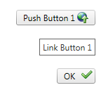

# Right-to-Left Support

The **RadButton** fully supports right-to-left (RTL) language locales (**Figure 1**).In order to turn on the RTL support you should set **dir=rtl to the html or body** element or at least to its parent element (**Figure 1**). You can also use the **direction:rtl** CSS property.

>caption Figure 1: RadButton in RTL mode.



>caption Example 1: Set the dir=rtl attribute to the **RadButton**'s wrapper element in order to enable the RTL support for the control.

````ASP.NET
<div dir="rtl">
	<telerik:RadButton runat="server" ID="RadButton1" Text="Push Button 1">
		<Icon SecondaryIconCssClass="rbUpload" SecondaryIconRight="10" SecondaryIconTop="3" />
	</telerik:RadButton>
	<br />
	<br />
	<telerik:RadButton runat="server" ID="RadButton2" Text="Link Button 1" ButtonType="LinkButton">
	</telerik:RadButton>
	<br />
	<br />
	<telerik:RadButton ID="BuiltinIconsButton2" runat="server" ButtonType="StandardButton"
		ToggleType="CustomToggle" AutoPostBack="false">
		<ToggleStates>
			<telerik:RadButtonToggleState SecondaryIconCssClass="rbOk" Text="OK" />
			<telerik:RadButtonToggleState SecondaryIconCssClass="rbCancel" Text="Cancel" />
		</ToggleStates>
	</telerik:RadButton>
</div>
````

## See Also

 * [See this live in an online demo](http://demos.telerik.com/aspnet-ajax/button/examples/righttoleft/defaultcs.aspx)

 * [WCAG 2.0 and Section 508 Accessibility Compliance]()

 * [Keyboard Support]()
