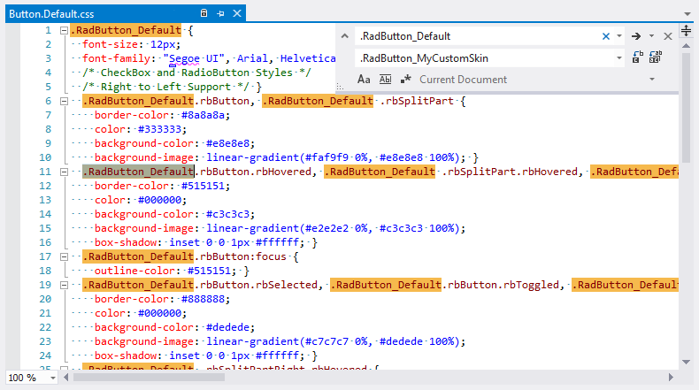

---
title: Creating a Custom LightWeight Skin
page_title: Creating a Custom LightWeight Skin | RadButton for ASP.NET AJAX Documentation
description: Creating a Custom LightWeight Skin
slug: button/appearance-and-styling/creating-a-custom-lightweight-skin
tags: creating,a,custom,lightweight,skin
published: True
position: 3
---

# Creating a Custom LightWeight Skin


## RadButton Custom Skin with LightWeight RenderMode

Each of the controls included in the **Telerik UI for ASP.NET AJAX** suite is styled with two CSS files that are loaded in acertain order. The first one – **[ControlName].css** , also called base stylesheet, contains CSS properties and values that are commonfor all skins, i.e it is layout-specific, not skin-specific. These are CSS float, padding, margin, font-size, font-family, etc. In the general case, when creating	a custom skin for a control this file should not be edited, unless the custom skin needs different sizes, padding and / or margins.

The second file represents the actual skin of the control, and its name consists of the control name plus the skin name, e.g. - **Button.Default.css**.Upon creating a custom skin for the control, one should edit that particular file, as it contains skin-specific CSS properties, and references to images, colors,borders and backgrounds.

As of **Q1 2015** RadButton has a [LightWeight render mode](), which uses semantically structured HTML and CSS3 for shadows, rounded corners and gradients.Overall, the skinning method is the same as for the Classic mode. The difference is that now there is one common sprite for all Light-Weighted controls called**radActionsSprite.png**. The sprite is placed in the **[SkinName]\Common** folder, e.g.:**[ControlsInstallationFolder]\Skins\Default\Common\radActionsSprite.png**

## Creating RadButton LightWeight Skin from Existing One

1. In your project, create a new directory named **Skins**;

1. In the **Skins** folder if you already have some custom skin, most probably you have already a folder named: **MyCustomSkin** – if you don’t – create one;

1. In the **Skins** folder create a new folder named: **MyCustomSkinLite** - this is the place where your Light-Weight custom skins CSS will be placed;

1. Go to **[ControlsInstallationFolder]\Skins\DefaultLite** and copy **Button.Default.css** in your **MyCustomSkinLite** folder;

1. Go to **[TelerikControlsInstallationFolder]\Skins\Default** and copy **Common** folder in your **MyCustomSkin** folder;

1. Rename **Button.Default.css** to **Button.MyCustomSkin.css**;

1. When you are finished you should have the following folder structure in your project:

* **Skins/MyCustomSkin/Common/** - containing several sprites;

* **Skins/MyCustomSkinLite/Button.MyCustomSkin.css**.

1. In order to support multiple skins of **RadButton** on a single page, the wrapping skin-specific class is coined by the name of thecontrol, plus underscore ("_") plus SkinName, i.e. **.RadButton_Default**, so in order to create a custom skin out of the Default skin, we should renameall occurrences of **"RadButton_Default"** in **Button.MyCustomSkin.css** to **"RadButton_MyCustomSkin"** as shown below:

1. Add a new server declaration of **RadButton** on your page, and set **Skin="MyCustomSkin"**and **EnableEmbeddedSkins="false"**:

````ASP.NET
			<telerik:RadButton ID="RadButton1" runat="server" EnableEmbeddedSkins="false" Skin="MyCustomSkin" />
````


1. Register **Button.MyCustomSkin.css** in the head section of your web page. In order to have the CSS applied correctly, the base stylesheet should come first in the DOM:

````ASP.NET
			<link href="Skins/MyCustomSkin/Button.MyCustomSkin.css" rel="stylesheet" type="text/css" />
````


1. Make sure the path to the files is correct; otherwise the skin will not apply;

1. To complete the customization, you will need to change the common sprite color according to your needs.Open **[ControlsInstallationFolder]\Skins\Default\radActionsSprite.png** and edit it as required.

1. Reload the page, and if the steps 1-12 have been followed correctly, you will see **RadButton** running a custom Default skin set as an external resource.

## RadButton LightWeight Custom Skin Example

Below is shown how to modify the CSS in order not only to change some colors and background colors, but also some base layout settings such as font size, element height, border-radius etc.

````ASP.NET
	<!DOCTYPE html>
	
	<html xmlns="http://www.w3.org/1999/xhtml">
	<head runat="server">
		<title></title>
		<style>
			/* Button normal state */
			.RadButton.RadButton_Default.rbButton,
			.RadButton.RadButton_Default.rbButton .rbSplitPart {
				background-color: #80078e;
				background-image: linear-gradient(#4f0258, #80078e 100%);
				border-color: #6b536e;
				color: #fff;
			}
	
			/* Button hovered state */
			.RadButton.RadButton_Default.rbButton.rbHovered,
			.RadButton.RadButton_Default.rbButton .rbSplitPart.rbHovered {
				background-color: #660283;
				background-image: linear-gradient(#660283, #f2ddf8 100%);
				border-color: #47035a;
				color: #3a0470;
			}
	
			/* Check and radio normal state */
			.RadButton.RadButton_Default.rbToggleButton .rbIcon:before, 
			.RadButton.RadButton_Default.rbCheckBox .rbIcon:before, 
			.RadButton.RadButton_Default.rbRadioButton .rbIcon:before {
				color: #9f50f0;
			}
	
			/* Check and radio hovered state */
			.RadButton.RadButton_Default.rbToggleButton.rbHovered .rbIcon:before, 
			.RadButton.RadButton_Default.rbCheckBox.rbHovered .rbIcon:before, 
			.RadButton.RadButton_Default.rbRadioButton.rbHovered .rbIcon:before {
				color: #530d9a;
			}
		</style>
	</head>
	<body>
		<form id="form1" runat="server">
			<asp:ScriptManager runat="server"></asp:ScriptManager>
			<telerik:RadButton runat="server" Text="Button" RenderMode="Lightweight"></telerik:RadButton>
			<telerik:RadButton runat="server" Text="Link Button" RenderMode="Lightweight" ButtonType="LinkButton"></telerik:RadButton>
			<telerik:RadButton runat="server" Text="Split Button Right" RenderMode="Lightweight" EnableSplitButton="true" SplitButtonPosition="Right"></telerik:RadButton>
			<telerik:RadButton runat="server" Text="Split Button Left" RenderMode="Lightweight" EnableSplitButton="true" SplitButtonPosition="Left"></telerik:RadButton>
			<telerik:RadButton runat="server" RenderMode="Lightweight" Text="Icon Left">
				<Icon PrimaryIconCssClass="rbPrint" />
			</telerik:RadButton>
			<telerik:RadButton runat="server" RenderMode="Lightweight" Text="Icon Left">
				<Icon SecondaryIconCssClass="rbCancel" />
			</telerik:RadButton>
			<telerik:RadButton runat="server" RenderMode="Lightweight" Text="Icon Left">
				<Icon PrimaryIconCssClass="rbPrevious" />
				<Icon SecondaryIconCssClass="rbNext" />
			</telerik:RadButton>
			<telerik:RadButton ID="RadButton22" runat="server" ToggleType="CheckBox" ButtonType="ToggleButton"
				GroupName="Radios" AutoPostBack="false" RenderMode="Lightweight">
				<ToggleStates>
					<telerik:RadButtonToggleState Text="Checked"></telerik:RadButtonToggleState>
					<telerik:RadButtonToggleState Text="UnChecked"></telerik:RadButtonToggleState>
				</ToggleStates>
			</telerik:RadButton>
		</form>
	</body>
	</html>
````


## See Also

 * [Render Modes]()
