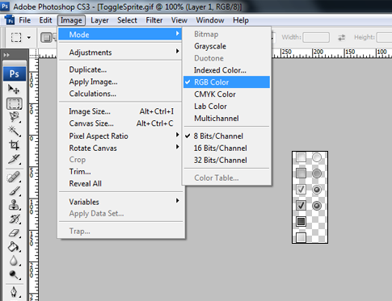

# Creating a Custom Skin

## Creating RadButton Custom Skin

Each of the controls included in the Telerik® UI for ASP.NET AJAX suite is styled by two CSS files that are loaded in a certain order.The first one - ControlName.css, also called the base stylesheet contains CSS properties and values that are common for all skins, i.e., it is layout-specific, not skin-specific. These are CSS float, padding, margin, font-size, font-family, etc.In the general case, when creating a custom skin for a control this file should not be edited, unless the custom skin needs different sizes, paddings or margins.The second file represents the actual skin of the control, and its name consists of the control name plus the skin name, i.e. Button.Default.css. Upon creating a custom skin for the control,one should edit that particular file, as it contains skin-specific CSS properties, and references to images, colors, borders and backgrounds.

## Creating a Custom Skin for RadButton for ASP.NET AJAX from an Existing One

1. In your project, create a new directory named **Skins**

2. In the **Skins** folder create a new directory **MyCustomSkin**.

3. Go to **~/[TelerikControlsInstallationFolder]/Skins/Default** and copy **Button.Default.css** and the **Skins/Default/Common** folder in your **Skins** folder.

4. Rename **Button.Default.css** to **Button.MyCustomSkin.css** and the folder **Default** to **MyCustomSkin**.

5. When you are finished you should have **Skins/MyCustomSkin/Button.MyCustomSkin.css** and **Skins/MyCustomSkin/Common**. The last folder contains the images for **MyCustomSkin**.

6. In order to support multiple skins of **RadButton**on a single page, the wrapping skin-specific class is coined by the name of the control, RadButton plus underscore ("_") plus SkinName, i.e. .RadButton_Default, so in order to create a custom skin out of the Default skin, we should rename all occurrences of "Default" in Button.MyCustomSkin.css to "MyCustomSkin" as shown below:

	

7. Add a new server declaration of RadButton on your page, and set **Skin="MyCustomSkin"** and **EnableEmbeddedSkins=”false”**:

	**ASP.NET**
     
		<telerik:RadButton RenderMode="Lightweight" ID="RadButton1" runat="server" Text="RadButton Submit" EnableEmbeddedSkins="false" Skin="MyCustomSkin">
		</telerik:RadButton>		

8. Register Button.MyCustomSkin.css in the ... section of your web page. In order to have the CSS applied correctly, the base stylesheet should come first in the DOM:

	**HTML**
	     
		<link href="Skins/MyCustomSkin/Button.MyCustomSkin.css" rel="stylesheet" type="text/css" />

	Make sure the path to the files is correct, otherwise the skin will not apply.

10. Reload the page, and if the steps 0-9 have been followed correctly, you will see RadButton running a custom Default skin set as an external resource.

## Modifying the Image Sprites to Achieve Totally New Looks for the Skin

Each skin of **RadButton** consists of two image sprites that are contained in the **Skins/SkinName/Common** folder. These are:

1. **radFormSprite.png** contains horizontal and vertical buttons and split border and arrows also.

2. **radFormToggleSprite.png** contains check boxes and radio buttons images.

Explained below is a simple method for modifying the image sprites of RadButton with Adobe© PhotoShop to achieve new looks without creating a new design.

1. Drag **radFormToggleSprite.png** and **radFormSprite.png** in Adobe© PhotoShop.

2. From the menu bar select Image » Mode » RGB Color to prepare the images for editing (convert from optimized Indexed Color to RGB Color):

	

3. Press Set Foreground Color in PhotoShop's toolbox to invoke the color picker dialog: 

	

4. Select a color that you like from the color dialog and then close it:

	

5. Choose the first image you will modify, for example ToggleSprite.gif, and select Image » Adjustments Hue » / Saturation to open the Hue / Saturation dialog of Adobe© PhotoShop: 

	

6. Check the colorize checkbox in the Hue / Saturation dialog, and the image you have selected will be immediately colorized in the hue you have selected from the toolbox:

	

	You may then play with the Hue, Saturation and Lightness sliders to fine tune or further modify the image. Make sure you memorize the values of the sliders, as you will need to add the same settings to all other images in order to achieve consistent looks

7. Press "OK" when you are finished

8. Select Image » Mode » Indexed Color to flatten the layers of the image

9. Save and close the image

10. Repeat Steps 5 - 9 for each of the remaining images

11. Once you are ready, save your work and reload the page. You will have a brand new skin based on Telerik's Default skin of RadButton

## See Also

 * [Skins]()

 * [CSS Classes]()

 * [Custom Height Tutorial]()

 * [Primary and Secondary Action Buttons]()
