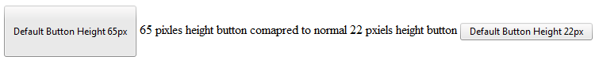
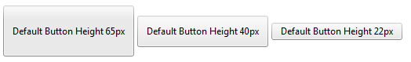

# Custom Height Tutorial

## RadButton Custom Height Tutorial

The **StandardButton** (**RadButton** with **ButtonType**="**StandardButton**") has a fixed height, which by default is 22px.

As of Q1 2011 a **StandardButton** can have its height set to 65px (**Figure 1**). This allows you to use bigger icons (24x24 pixels), and to place the content (icons and text) horizontally or vertically.

>tip This article applies to the Classic [Render Node](). The **Lightweight** render mode supports [fluid design]() so you can set its height as desired. Since a CSS gradient is used for the backround, the browser will stretch it accordingly, as opposed to the image sprite the Classic mode uses.

>caption Example 1: Configure a custom height of 65px for the **RadButton** with **ButtonType="StandardButton"**).

````ASP.NET
<telerik:radbutton id="RadButton1" runat="server" text="Default Button Height 65px"
	height="65px">
</telerik:radbutton>
````

>caption Figure 1: RadButton (ButtonType="StandardButton") with custom height of 65px.



## Creating button with a Custom height

However if you want to use a button with a height different than 65 or 22 pixels, you will need to modify the CSS of the RadButton and create new sprites. This tutorial demonstrates how to do this.

**New Sprite**

You will need to set a new CSS class (customHeight40) which will be used to cascade through, and to override the existing CSS settings and to set new height. In the current case we will create a button with 40px height.

````ASP.NET
	    <telerik:radbutton id="RadButton3" runat="server" text="Default Button Height 40px"
	        height="40px" cssclass="customHeight40">
		</telerik:radbutton>
````


Next step is to create a new image sprite, based on Telerik Default skin theme, where the button height is sized to 40px. You could use Adobe Photoshop or another image editor software. The original RadButton sprite has six parts for the default button look. First row contains normal state rounded right corner background; second row contains central and left part of the button background. Third row contains hover state rounded right corner background; fourth row contains central and left part of the button background. Fifth row contains active state rounded right corner background; Sixth row contains central and left part of the button background.

**Playing with CSS**

Now that we have the sprite, it is necessary to set new height to the button with the specific class and also set the new background positions. This is done by using our additional CSS class - customHeight40. Using an additional CSS class will allow us to keep the 65px button and in the same time to create as many different height buttons as we need it e.g. (cutomHeight40, cutomHeight45, cutomHeight50), of course you could name the CSS classes on your choice.

````JavaScript
/* IE7 line height */
* + html .rbVerticalButton.customHeight40 input.rbDecorated
{
	line-height: 40px !important;
}

.RadButton.rbVerticalButton.customHeight40, 
.RadButton.rbVerticalButton.customHeight40.rbDisabled, 
.RadButton.rbVerticalButton.customHeight40:hover, 
.RadButton.rbVerticalButton.customHeight40:active
{
	padding-right: 4px;
	background-color: transparent;
	border: 0;
}

.rbVerticalButton.customHeight40 .rbDecorated, 
.rbVerticalButton.customHeight40 .rbDecorated:hover, 
.rbVerticalButton.customHeight40 .rbDecorated:active
{
	background-color: transparent;
	padding-left: 10px;
	padding-right: 6px;
}

/* new sprite */
.rbVerticalButton.customHeight40, 
.rbVerticalButton.customHeight40 input.rbDecorated
{
	background-image: url(customHeight.gif) !important;
}
/* right rounded corner position */
.rbVerticalButton.customHeight40, 
.rbVerticalButton.customHeight40.rbDisabled:hover, 
.rbVerticalButton.customHeight40.rbDisabled:active, 
.rbVerticalButton.customHeight40.rbDisabled:focus
{
	background-position: right 0;
}

/* left rounded corner position */
.rbVerticalButton.customHeight40 input.rbDecorated, 
.rbVerticalButton.customHeight40.rbDisabled:hover input.rbDecorated, 
.rbVerticalButton.customHeight40.rbDisabled:active input.rbDecorated, 
.rbVerticalButton.customHeight40.rbDisabled:focus input.rbDecorated
{
	background-position: 0 -40px;
}
/* right rounded corner position hover state */
.rbVerticalButton.customHeight40:hover
{
	background-position: right -80px;
}
/* left rounded corner position hover state */
.rbVerticalButton.customHeight40:hover input.rbDecorated
{
	background-position: left -120px;
}
/* right rounded corner position active and focus states */
.rbVerticalButton.customHeight40:focus, 
.rbVerticalButton.customHeight40:active
{
	background-position: right -160px;
}
/* left rounded corner position active and focus states */
.rbVerticalButton.customHeight40:focus input.rbDecorated, 
.rbVerticalButton.customHeight40:active input.rbDecorated
{
	background-position: left -200px;
}
/* IE and Opera Focus and Active state fix with additional class, should be used !important */
.rbVerticalButton.customHeight40.rbPressedButton
{
	background-position: right -160px !important;
}

.rbVerticalButton.customHeight40.rbPressedButton input.rbDecorated
{
	background-position: left -200px !important;
}
/* IE8 Onclickg filckering Bug fix */
.rbVerticalButton.customHeight40.rbPressedIE8 input.rbDecorated, 
.rbVerticalButton.customHeight40.rbPressedIE8Rtl input.rbDecorated
{
	-ms-background-position-x: 1px !important;
	-ms-background-position-y: -199px !important;
}

.rbVerticalButton.customHeight40.rbPressedIE8Rtl input.rbDecorated
{
	-ms-background-position-x: -1px !important;
}

@media screen and (-webkit-min-device-pixel-ratio: 0)
{
	.RadButton.rbVerticalButton.customHeight40, 
	.RadButton.rbVerticalButton.customHeight40:hover, 
	.RadButton.rbVerticalButton.customHeight40:active, 
	.RadButton.rbVerticalButton.customHeight40.rbDisabled
	{
		padding-right: 2px;
	}
}	
````

As you could see all rules are explained with comments and you could easily find what should be changed in order to have your custom button. The CSS could be placed in a separate file, which will be linked to your application or as it is in this sample project, in the head section of the document.



## See Also

 * [Skins]()

 * [CSS Classes]()

 * [Creating a Custom Skin]()

 * [Primary and Secondary Action Buttons]()
