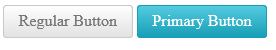

# Primary State


**RadButton** offers an additional "primary" state (**Figure 1**) that uses bright and saturated colors to have the button pop up more and catch attention easily. This feature is available as of **Q1 2016**. For older versions, see the [Older Versions](#older-versions) section.

>caption Figure 1: RadButton in its regular and primary state.



To switch to the primary state, set the `Primary` property of the **RadButton** control to `true` and its **[RenderMode]()** property to `Lightweight` (**Example 1**). The property defaults to `false` result in the regular button appearance for most cases.

>caption Example 1: Configure the primary state of a RadButton instance.

````ASP.NET
<telerik:RadButton runat="server" ID="RadButton1" Text="Regular Button" RenderMode="Lightweight" Skin="Silk"></telerik:RadButton>
<telerik:RadButton runat="server" ID="RadButton2" Primary="true" Text="Primary Button" RenderMode="Lightweight" Skin="Silk"></telerik:RadButton>
````


## Older Versions

To put a button in its primary state in a version **prior to Q1 2016**, you should set its `CssClass` property to `rbPrimaryButton` (**Example 2**). This state, however, is only available for the **Silk**, **Glow** and **Bootstrap** skins.

>caption Example 2: Configure the primary state of a RadButton for the **Silk**, **Glow** and **Bootstrap** skins in versions **prior to Q1 2016**.

````ASP.NET
Silk Skin:
<telerik:RadButton ID="RadButton1" runat="server" Text="Primary Button" Skin="Silk" CssClass="rbPrimaryButton" />
<telerik:RadButton ID="RadButton2" runat="server" Text="Secondary Button" Skin="Silk" />
<br />

Glow Skin:
<telerik:RadButton ID="RadButton3" runat="server" Text="Primary Button" Skin="Glow" CssClass="rbPrimaryButton" />
<telerik:RadButton ID="RadButton4" runat="server" Text="Secondary Button" Skin="Glow" />
<br />

Bootstrap Skin:
<telerik:RadButton ID="RadButton5" runat="server" Text="Primary Button" Skin="Bootstrap" CssClass="rbPrimaryButton" />
<telerik:RadButton ID="RadButton6" runat="server" Text="Secondary Button" Skin="Bootstrap" />
````


## See Also

 * [Skins]()

 * [CSS Classes]()

 * [Creating a Custom Skin]()

 * [Custom Height Tutorial]()

 * [RenderMode]()
