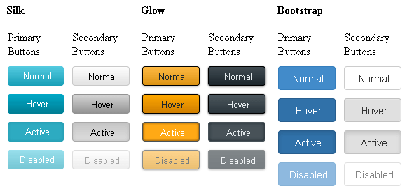

# Primary and Secondary Action Buttons


## 

__RadButton__ offers primary and secondary states, named primary and secondary action buttons (__Figure 1__),that share a unique innovation styles for some skins(__Bootstrap__, __Silk__ and __Glow__). __Primary__ action buttons use bright and saturated colors that pop up more and catch attention easily, while the __Secondary buttons__are the default ones.
>caption Figure 1: RadButton with primary and secondary action states for the Silk, Glow and Bootstrap skins.



In order to switch to the primary state you must set the __CssClass__ property of the __RadButton__ to __rbPrimaryButton__ (see __Example 1__ below).

__Example 1__: Configure primary and secondary action buttons for the __Silk__, __Glow__and __Bootstrap__ skins in __RadButton__.

````ASPNET
			Silk Skin:
			<telerik:RadButton ID="RadButton1" runat="server" Text="Primary Button" Skin="Silk" CssClass="rbPrimaryButton" />
			<telerik:RadButton ID="RadButton2" runat="server" Text="Secondary Button" Skin="Silk" />
			<br />
			Glow Skin:
			<telerik:RadButton ID="RadButton3" runat="server" Text="Primary Button" Skin="Glow" CssClass="rbPrimaryButton" />
			<telerik:RadButton ID="RadButton4" runat="server" Text="Secondary Button" Skin="Glow" />
			<br />
			Bootstrap Skin:
			<telerik:RadButton ID="RadButton5" runat="server" Text="Primary Button" Skin="Bootstrap" CssClass="rbPrimaryButton" />
			<telerik:RadButton ID="RadButton6" runat="server" Text="Secondary Button" Skin="Bootstrap" />
````


## Example that Creates Figure 1


````ASPNET
	<style>
		.buttonsWrapper {
			display: inline-block;
		}
	
		td {
			padding: 5px;
		}
		.skinName {
			margin-left: 5px;
		}
	</style>
	<div class="buttonsWrapper">
		<asp:Label ID="Label1" Text="" runat="server" Font-Bold="true" CssClass="skinName" />
		<table>
			<thead>
				<tr>
					<td>
						
					</td>
				</tr>
			</thead>
			<tbody>
				<tr>
					<td>PRIMARY
						<br />
						BUTTONS
					</td>
					<td>SECONDARY
						<br />
						BUTTONS
					</td>
				</tr>
				<tr>
					<td>
						<telerik:RadButton ID="RadButton1" runat="server" Text="Normal" Width="60px" CssClass="rbPrimaryButton" />
					</td>
					<td>
						<telerik:RadButton ID="RadButton2" runat="server" Text="Normal" Width="60px" />
					</td>
				</tr>
				<tr>
					<td>
						<telerik:RadButton ID="RadButton3" runat="server" Text="Hover" Width="60px" CssClass="rbPrimaryButton" />
					</td>
					<td>
						<telerik:RadButton ID="RadButton4" runat="server" Text="Hover" Width="60px" />
					</td>
				</tr>
				<tr>
					<td>
						<telerik:RadButton ID="RadButton5" runat="server" Text="Active" Width="60px" CssClass="rbPrimaryButton" />
					</td>
					<td>
						<telerik:RadButton ID="RadButton6" runat="server" Text="Active" Width="60px" />
					</td>
				</tr>
				<tr>
					<td>
						<telerik:RadButton ID="RadButton7" runat="server" Text="Disabled" Width="60px" Enabled="false" CssClass="rbPrimaryButton" />
					</td>
					<td>
						<telerik:RadButton ID="RadButton8" runat="server" Text="Disabled" Width="60px" Enabled="false" />
					</td>
				</tr>
			</tbody>
		</table>
	</div>
````
````C#
		protected void Page_Load(object sender, EventArgs e)
		{
			//Load the user control with the RadButton with Silk, Glow and BootStrap skins
			LoadUserControl("RadButtonsUserControl.ascx", "RadButtonsUserControl1", "Silk");
			LoadUserControl("RadButtonsUserControl.ascx", "RadButtonsUserControl2", "Glow");
			LoadUserControl("RadButtonsUserControl.ascx", "RadButtonsUserControl3", "Bootstrap");
		}
	
		protected void LoadUserControl(string controlName, string controlID, string skin)
		{
			//Load the user control
			UserControl userControl = (UserControl)this.LoadControl(controlName);
			userControl.ID = controlID;
			//Set the skin for the controls inside the user control
			SetUserControlSkin(skin, userControl.Controls);
			//Add the user control to the form
			this.form1.Controls.Add(userControl);
		}
	
		protected void SetUserControlSkin(string skinName, ControlCollection cc)
		{
			(cc[1] as Label).Text = skinName.ToUpper();
			for (int i = 2; i < cc.Count; i++)
			{
				Control currControl = cc[i];
				if (currControl.GetType().Name == "RadButton")
				{
					(currControl as RadButton).Skin = skinName;
				}
			}
		}
````
````VB.NET
	    Protected Sub Page_Load(sender As Object, e As EventArgs)
	        'Load the user control with the RadButton with Silk, Glow and BootStrap skins
	        LoadUserControl("RadButtonsUserControl.ascx", "RadButtonsUserControl1", "Silk")
	        LoadUserControl("RadButtonsUserControl.ascx", "RadButtonsUserControl2", "Glow")
	        LoadUserControl("RadButtonsUserControl.ascx", "RadButtonsUserControl3", "Bootstrap")
	    End Sub
	
	    Protected Sub LoadUserControl(controlName As String, controlID As String, skin As String)
	        'Load the user control
	        Dim userControl As UserControl = DirectCast(Me.LoadControl(controlName), UserControl)
	        userControl.ID = controlID
	        'Set the skin for the controls inside the user control
	        SetUserControlSkin(skin, userControl.Controls)
	        'Add the user control to the form
	        Me.form1.Controls.Add(userControl)
	    End Sub
	
	    Protected Sub SetUserControlSkin(skinName As String, cc As ControlCollection)
	        TryCast(cc(1), Label).Text = skinName.ToUpper()
	        For i As Integer = 2 To cc.Count - 1
	            Dim currControl As Control = cc(i)
	            If currControl.[GetType]().Name = "RadButton" Then
	                TryCast(currControl, RadButton).Skin = skinName
	            End If
	        Next
	    End Sub
````


# See Also

 * [Skins]()

 * [CSS Classes]()

 * [Creating a Custom Skin]()

 * [Custom Height Tutorial]()
