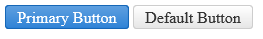

# Primary Action Button


**RadButton** can be a Primary Action Button (**Figure 1**). This feature is built-in as of **Q1 2016**. For older versions, see the [Older Versions](#older-versions) section.

The primary action button on the form has bright and saturated colors to pop up more and catch attention easily. You should use a primary action button to make the default/preferred/main/safe operation on the form stand out. At this point the rest of the buttons with their default appearance become Secondary Action buttons and do not draw as much attention.


>caption Figure 1: Primary RadButton next to a default RadButton.



To switch to a primary action button, set the `Primary` property of the **RadButton** control to `true` and its **[RenderMode]()** property to `Lightweight` (**Example 1**). The property defaults to `false` result in the regular (secondary) button appearance for most cases.

>caption Example 1: Configure a RadButton to be a primary action button.

````ASP.NET
<telerik:RadButton runat="server" ID="RadButton1" Primary="true" Text="Primary Button" RenderMode="Lightweight"></telerik:RadButton>
<telerik:RadButton runat="server" ID="RadButton2" Text="Default Button" RenderMode="Lightweight"></telerik:RadButton>
````


## Older Versions

To configure a **RadButton** as a primary action button in a version **prior to Q1 2016**, you should set its `CssClass` property to `rbPrimaryButton` (**Example 2**). This appearance, however, is only available for the **Silk**, **Glow** and **Bootstrap** skins.

>caption Example 2: Configure a RadButton as a primary action button for the **Silk**, **Glow** and **Bootstrap** skins in versions **prior to Q1 2016**.

````ASP.NET
Silk Skin:
<telerik:RadButton ID="RadButton1" runat="server" Text="Primary Button" Skin="Silk" CssClass="rbPrimaryButton" />
<telerik:RadButton ID="RadButton2" runat="server" Text="Default Button" Skin="Silk" />
<br />

Glow Skin:
<telerik:RadButton ID="RadButton3" runat="server" Text="Primary Button" Skin="Glow" CssClass="rbPrimaryButton" />
<telerik:RadButton ID="RadButton4" runat="server" Text="Default Button" Skin="Glow" />
<br />

Bootstrap Skin:
<telerik:RadButton ID="RadButton5" runat="server" Text="Primary Button" Skin="Bootstrap" CssClass="rbPrimaryButton" />
<telerik:RadButton ID="RadButton6" runat="server" Text="Default Button" Skin="Bootstrap" />
````


## See Also

 * [Skins]()

 * [CSS Classes]()

 * [Creating a Custom Skin]()

 * [Custom Height Tutorial]()

 * [RenderMode]()
