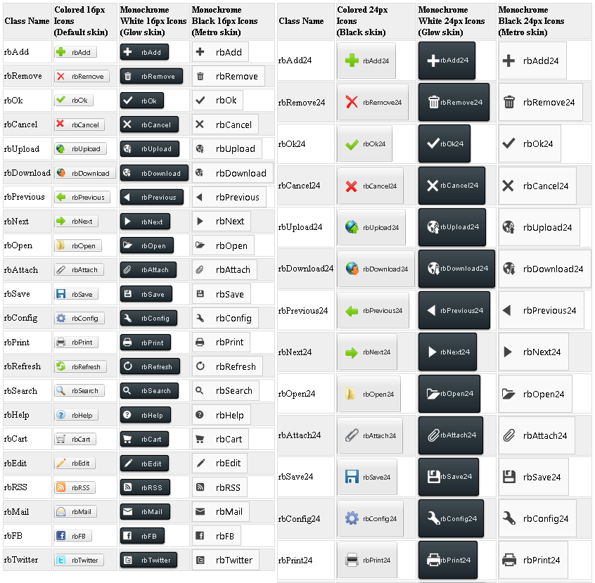
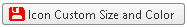

# Embedded Icons


This help article illustrates how to configure a RadButton with embedded icons for classic render mode.

## Configure RadButton with Embedded Icons

To make the control even easier to use Telerik provides a large set of built-in icons. To use them, set the __PrimaryIconCssClass__ or __SecondaryIconCssClass__ property to one of the predefined CSS class names, and the respective icon will be shown on the control. The full list of the CSS classes can be found in __List 1__.

__List 1:__ CSS classes of embedded icons in __RadButton__.

* rbAdd

* rbRemove

* rbOk

* rbCancel

* rbUpload

* rbDownload

* rbPrevious

* rbNext

* rbOpen

* rbAttach

* rbSave

* rbConfig

* rbPrint

* rbRefresh

* rbSearch

* rbHelp

* rbCart

* rbEdit

* rbRSS

* rbMail

* rbFB

* rbTwitter


>note The __CssClass__ is composed in the following way: [ __r__ ]ad[ __b__ ]utton[ __IconName__ ]. For example rbAdd.
>


### Configure RadButton's Embedded Icons in Classic Render Mode

__RadButton__ in classic render mode provides two sets of built-in icons with height of 16px and 24px (__Table 1__). The smaller icons are appropriate for buttons that have the default height of 22px, while the bigger icons are appropriate for 65px height buttons.


>caption  Table 1: RadButton offers two sets of built-in icons of 16px and 24px height. 

| Icon Height | CssClass | Description |
| ------ | ------ | ------ |
|16px|All the classes from the __List 1__ (e.g., __PrimaryIconCssClass__ = " __rbOk__ ").|Useful for buttons with default height of 22px.|
|24px|All the classes from the __List 1__ , concatenated with the "24" string. (e.g., __PrimaryIconCssClass__ = " __rbOk24__ ").|Useful for buttons with height of 65px (see the[Custom Height Tutorial]()help article).|

Each of these built-in icons is offered with three different colors, depending on the chosen skin (see __Figure 1__):

* Monochrome white icons - used by __BlackMetroTouch__ and __Glow__ skins.

* Monochrome black icons - used by __Metro__, __MetroTouch__ and __Silk__ skins.

* Colored icons - used by the rest of the skin.

>important The color for the embedded icons is automatically determined from the skin and cannot be modified. For example you cannot use white monochrome icons for the __Windows7__ skin.
>

>caption Figure 1: Embedded icons in RadButton for the Classic RenderMode are provided with two predefined heights and three different colors for the corresponding skin.



__Example 1__: Embedded icons in __RadButton__ can be configured through the __PrimaryIconCssClass__ and __SecondaryIconCssClass__ properties. This example creates the tables from __Figure 1__.


````ASPNET
			<style type="text/css">
				/*Format tables*/
				tr:first-child {
					font-weight: bold;
				}
	
				tr:nth-child(odd) {
					background: #efefef;
				}
	
				td {
					border: 1px solid #ddd;
				}
	
				table {
					display: inline;
					float: left;
				}
			</style>
			<telerik:RadScriptManager ID="RadScriptManager1" runat="server"></telerik:RadScriptManager>
			<table id="table1" runat="server">
				<tr>
					<td>Class Name</td>
					<td>Colored 16px<br />
						Icons<br />
						(Default skin)
					</td>
					<td>Monochrome
						<br />
						White 16px Icons<br />
						(Glow skin)</td>
					<td>Monochrome<br />
						Black 16px Icons<br />
						(Metro skin)</td>
				</tr>
			</table>
			<table id="table2" runat="server">
				<tr>
					<td>Class Name</td>
					<td>Colored 24px<br />
						Icons<br />
						(Black skin)
					</td>
					<td>Monochrome<br />
						White 24px Icons<br />
						(Glow skin)</td>
					<td>Monochrome<br />
						Black 24px Icons<br />
						(Metro skin)</td>
				</tr>
			</table>
````
````C#
		protected void Page_Init(object sender, EventArgs e)
		{
			string[] embeddedIcons = new string[] { "rbAdd", "rbRemove", "rbOk", "rbCancel", "rbUpload", "rbDownload", "rbPrevious", "rbNext", "rbOpen", "rbAttach",
			"rbSave", "rbConfig", "rbPrint", "rbRefresh", "rbSearch", "rbHelp", "rbCart", "rbEdit", "rbRSS", "rbMail", "rbFB", "rbTwitter"};
	
			for (int i = 0; i < embeddedIcons.Length; i++)
			{
				string currIcon = embeddedIcons[i];
				string currIcon24 = currIcon + "24";
	
				ConfigureTableIcons16(currIcon, i.ToString());
				ConfigureTableIcons24(currIcon24, i.ToString());
			}
		}
	
		protected void ConfigureTableIcons16(string icon, string index)
		{
			//Add class name for 16px icons:
			HtmlTableRow row1 = new HtmlTableRow();
			AddRowIconClassName(icon, table1, row1);
	
			//Add RadButton 16px color icons, Default skin:
			AddRadButtonWithIcon("0" + index, icon, "Default", null, null, table1, row1);
	
			//Add RadButton 16px monochrome white icons, Glow skin:
			AddRadButtonWithIcon("1" + index, icon, "Glow", null, 5, table1, row1);
	
			//Add RadButton 16px monochrome black icons, MetroTouch skin:
			AddRadButtonWithIcon("2" + index, icon, "MetroTouch", null, null, table1, row1);
		}
	
		protected void ConfigureTableIcons24(string icon, string index)
		{
			//Add class name for 24px icons:
			HtmlTableRow row1 = new HtmlTableRow();
			AddRowIconClassName(icon, table2, row1);
	
			//Add RadButton 24px color icons, Default skin:
			AddRadButtonWithIcon("3" + index, icon, "Default", 65, null, table2, row1);
	
			//Add RadButton 24px monochrome white icons, Glow skin:
			AddRadButtonWithIcon("4" + index, icon, "Glow", 65, 20, table2, row1);
	
			//Add RadButton 24px monochrome black icons, MetroTouch skin:
			AddRadButtonWithIcon("5" + index, icon, "MetroTouch", 65, 20, table2, row1);
		}
	
		protected void AddRowIconClassName(string icon, HtmlTable table, HtmlTableRow row)
		{
			HtmlTableCell cell1 = new HtmlTableCell();
			cell1.InnerHtml = icon;
			row.Cells.Add(cell1);
			table.Rows.Add(row);
		}
	
		protected void AddRadButtonWithIcon(string ID, string IconName, string Skin, int? Height, int? Top, HtmlTable table, HtmlTableRow row)
		{
			HtmlTableCell cell = new HtmlTableCell();
			RadButton RadButton1 = new RadButton()
			{
				ID = "RadButton1" + ID,
				Text = IconName,
				Skin = Skin,
			};
			if (Height != null)
				RadButton1.Height = Unit.Pixel((int)Height);
	
			RadButton1.Icon.PrimaryIconCssClass = IconName;
			if (Top != null)
				RadButton1.Icon.PrimaryIconTop = Unit.Pixel((int)Top);
	
			cell.Controls.Add(RadButton1);
			row.Cells.Add(cell);
			table.Rows.Add(row);
		}
````
````VB.NET
	    Protected Sub Page_Init(sender As Object, e As EventArgs)
	        Dim embeddedIcons As String() = New String() {"rbAdd", "rbRemove", "rbOk", "rbCancel", "rbUpload", "rbDownload", _
	            "rbPrevious", "rbNext", "rbOpen", "rbAttach", "rbSave", "rbConfig", _
	            "rbPrint", "rbRefresh", "rbSearch", "rbHelp", "rbCart", "rbEdit", _
	            "rbRSS", "rbMail", "rbFB", "rbTwitter"}
	
	        For i As Integer = 0 To embeddedIcons.Length - 1
	            Dim currIcon As String = embeddedIcons(i)
	            Dim currIcon24 As String = currIcon & "24"
	
	            ConfigureTableIcons16(currIcon, i.ToString())
	            ConfigureTableIcons24(currIcon24, i.ToString())
	        Next
	    End Sub
	
	    Protected Sub ConfigureTableIcons16(icon As String, index As String)
	        'Add class name for 16px icons:
	        Dim row1 As New HtmlTableRow()
	        AddRowIconClassName(icon, table1, row1)
	
	        'Add RadButton 16px color icons, Default skin:
	        AddRadButtonWithIcon("0" & index, icon, "Default", Nothing, Nothing, table1, _
	            row1)
	
	        'Add RadButton 16px monochrome white icons, Glow skin:
	        AddRadButtonWithIcon("1" & index, icon, "Glow", Nothing, 5, table1, _
	            row1)
	
	        'Add RadButton 16px monochrome black icons, MetroTouch skin:
	        AddRadButtonWithIcon("2" & index, icon, "MetroTouch", Nothing, Nothing, table1, _
	            row1)
	    End Sub
	
	    Protected Sub ConfigureTableIcons24(icon As String, index As String)
	        'Add class name for 24px icons:
	        Dim row1 As New HtmlTableRow()
	        AddRowIconClassName(icon, table2, row1)
	
	        'Add RadButton 24px color icons, Default skin:
	        AddRadButtonWithIcon("3" & index, icon, "Default", 65, Nothing, table2, _
	            row1)
	
	        'Add RadButton 24px monochrome white icons, Glow skin:
	        AddRadButtonWithIcon("4" & index, icon, "Glow", 65, 20, table2, _
	            row1)
	
	        'Add RadButton 24px monochrome black icons, MetroTouch skin:
	        AddRadButtonWithIcon("5" & index, icon, "MetroTouch", 65, 20, table2, _
	            row1)
	    End Sub
	
	    Protected Sub AddRowIconClassName(icon As String, table As HtmlTable, row As HtmlTableRow)
	        Dim cell1 As New HtmlTableCell()
	        cell1.InnerHtml = icon
	        row.Cells.Add(cell1)
	        table.Rows.Add(row)
	    End Sub
	
	    Protected Sub AddRadButtonWithIcon(ID As String, IconName As String, Skin As String, Height As System.Nullable(Of Integer), Top As System.Nullable(Of Integer), table As HtmlTable, _
	        row As HtmlTableRow)
	        Dim cell As New HtmlTableCell()
	        Dim RadButton1 As New RadButton() With {
	            .ID = "RadButton1" & ID, _
	            .Text = IconName, _
	            .Skin = Skin _
	        }
	        If Height IsNot Nothing Then
	            RadButton1.Height = Unit.Pixel(CInt(Height))
	        End If
	
	        RadButton1.Icon.PrimaryIconCssClass = IconName
	        If Top IsNot Nothing Then
	            RadButton1.Icon.PrimaryIconTop = Unit.Pixel(CInt(Top))
	        End If
	
	        cell.Controls.Add(RadButton1)
	        row.Cells.Add(cell)
	        table.Rows.Add(row)
	    End Sub
````


### Configure RadButton's Embedded Icons in Lightweight Render Mode

The embedded icons of __RadButton__ in the Lightweight RenderMode are font icons (__Figure 2__) asopposed to the Classic RenderMode where sprite images are used (__Figure 1__). Using a font facilitates the customization of the icons. For example, you can change the icons color and font size with a single line of CSS (__Figure 3__ and __Example 3__). The list of the predefined CSS classes can be found in __List 1__.
>caption Figure 2: Embedded icons of RadButton in Lightweight RenderMode for Default and Black skin.


__Example 2__: Declaration of two RadButtons with primary icon in Lightweight RenderMode for Default and Black skin.

````ASPNET
			<telerik:RadButton ID="RadButton1" runat="server" Text="Default Skin" Skin="Default" RenderMode="Lightweight">
				<Icon PrimaryIconCssClass="rbOk" />
			</telerik:RadButton>
			<telerik:RadButton ID="RadButton2" runat="server" Text="Black Skin" Skin="Black" RenderMode="Lightweight">
				<Icon PrimaryIconCssClass="rbOk" />
			</telerik:RadButton>
````


>caption Figure 3: You can easily customize the font size and color of the embedded icons of RadButton in Lightweight RenderMode with CSS.



__Example 3__: Use only CSS to modify the font size and color of embedded icons of RadButton in Lightweight RenderMode.

````ASPNET
			<style type="text/css">
				button.RadButton.customizeIcon .rbPrimaryIcon {
					color: red;
					font-size:15px;
				}
			</style>
			<telerik:RadButton ID="RadButton1" runat="server" Text="Icon Custom Size and Color" RenderMode="Lightweight" CssClass="customizeIcon">
				<Icon PrimaryIconCssClass="rbSave" PrimaryIconTop="2px" />
			</telerik:RadButton>
````


# See Also

 * [Overview]()

 * [Button - Embedded Icons Online Demo](http://demos.telerik.com/aspnet-ajax/button/examples/embeddedicons/defaultcs.aspx)
