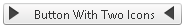
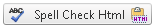

# Icons Overview

This help article showcases how to setup **RadButton's** icons for its different states and fine tune their position.

1. [Configure RadButton With Icons](#configure-radbutton-with-icons)

1. [Fine-tuning RadButton's Icon Position](#fine-tuning-radbutton's-icon-position)

## Configure RadButton With Icons

You can make your button more intuitive by showing an icon on the left-hand and/or right-hand side of the control (**Example 1** and **Figure 1**). All the Icon-related properties are controlled through the **RadButton.Icon** inner property. To display an icon on the button, you need to set either the **Icon.PrimaryIconCssClass** (**SecondaryIconCssClass**) property, or the **Icon.PrimaryIconUrl** (**SecondaryIconUrl**) property.

>caption Figure 1: A RadButton with a primary and a secondary icon.



>caption Example 1: Configure a **RadButton** with two icons through the **Icon.PrimaryIconUrl**, **Icon.PrimaryIconCssClass** and **Icon.SecondaryIconCssClass** properties.

````ASP.NET
<style type="text/css">
	.classNextArrow, classPreviousArrow{
		background-image: url('https://demos.telerik.com/aspnet-ajax/button/examples/embeddedicons/images/rbPredefinedIcons.png');
	}

	.classNextArrow {
		background-position: -168px 0;
	}

	.classPreviousArrow {
		background-position: -144px 0;
	}
</style>

<telerik:RadButton RenderMode="Lightweight" ID="RadButton1" runat="server" Text="Button With Two Icons">
	<Icon PrimaryIconUrl="https://demos.telerik.com/aspnet-ajax/button/examples/embeddedicons/images/rbPredefinedIcons.png" 
		PrimaryIconCssClass="classNextArrow"
		SecondaryIconCssClass="classPreviousArrow" />
</telerik:RadButton>
````

**RadButton** provides an easy way to show different icon when the mouse is over the control, or the button is pressed (**Figure 2** and **Example 2**). This is achieved through the properties shown in **Table 1**.

>caption  Table 1: RadButton properties that control the primary and secondary icon for the hovered and/or active state. 

| Button State | Primary Icon Property | Secondary Icon Property |
| ------ | ------ | ------ |
|Hovered| **Icon.PrimaryHoveredIconUrl** | **Icon.SecondaryHoveredIconUrl** |
|Active(Pressed)| **Icon.PrimaryPressedIconUrl** | **Icon.SecondaryPressedIconUrl** |
>caption Figure 2: A RadButton can have different icons for its normal, hovered and active state.


**Example 2:** Setup unique icons for the normal, hovered and active state of a **RadButton**.

````ASP.NET
<style>
	.classNextArrow, .classPreviousArrow {
		background-image: url('https://demos.telerik.com/aspnet-ajax/button/examples/embeddedicons/images/rbPredefinedIcons.png');
	}
	
	.classNextArrow {
		background-position: -168px 0;
	}

	.classPreviousArrow {
		background-position: -144px 0;
	}
</style>

<telerik:RadButton RenderMode="Lightweight" ID="RadButton1" runat="server" Text="Button With Two Icons">
	<Icon PrimaryIconUrl="https://demos.telerik.com/aspnet-ajax/button/examples/embeddedicons/images/rbPredefinedIcons.png" PrimaryIconCssClass="classNextArrow"
		SecondaryIconCssClass="classPreviousArrow" />
</telerik:RadButton>
````

## Fine-tuning RadButton's Icon Position

At first the Icons might not be positioned exactly the way we want, but this can be easily changed by directly setting the properties that control the top, bottom, left or right offset of the respective icon (**Table 2**):

>caption  Table 2: RadButton properties that control the offset of the primary and secondary icon. 

| Offset | Primary Icon Property | Secondary Icon Property |
| ------ | ------ | ------ |
|Top| **Icon.PrimaryIconTop** | **Icon.SecondaryIconTop** |
|Bottom| **Icon.PrimaryIconBottom** | **Icon.SecondaryIconBottom** |
|Left| **Icon.PrimaryIconLeft** | **Icon.SecondaryIconLeft** |
|PrimaryIconRight| **Icon.PrimaryIconRight** | **Icon.SecondaryIconRight** |

Alternatively, a CSS class can be set to the icon, and the position configured using CSS.

1. Properties:

	**ASP.NET**
	
		<telerik:RadButton RenderMode="Lightweight" ID="RadButton2" runat="server" Text="Spell Check Html">
			<Icon PrimaryIconUrl="https://demos.telerik.com/aspnet-ajax/button/examples/customicons/images/eSpellCheck.png" 
				PrimaryIconTop="4px" PrimaryIconLeft="5px"
				SecondaryIconUrl="https://demos.telerik.com/aspnet-ajax/button/examples/customicons/images/eHtml.png" 
				SecondaryIconTop="4px" SecondaryIconRight="5px" />
		</telerik:RadButton>

1. Or the same configuration using CSS classes:

	**CSS**
	
		<style type="text/css">
			.classSpellCheck {
				top: 4px;
				left: 5px;
			}

			.classHtml {
				top: 4px;
				right: 5px;
			}
		</style>

	**ASP.NET**

		<telerik:RadButton RenderMode="Lightweight" ID="RadButton3" runat="server" Text="Spell Check Html">
			<Icon PrimaryIconUrl="https://demos.telerik.com/aspnet-ajax/button/examples/customicons/images/eSpellCheck.png" PrimaryIconCssClass="classSpellCheck"
				SecondaryIconUrl="https://demos.telerik.com/aspnet-ajax/button/examples/customicons/images/eHtml.png" SecondaryIconCssClass="classHtml" />
		</telerik:RadButton>
	
	
	>caption Figure 3: Primary and Secondary icons in RadButton can be offset.

	

## See Also

 * [Embedded Icons]()

 * [Split Button]()

 * [Icons Overview]()

 * [Image Button]()

 * [Toggle button]()
