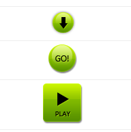
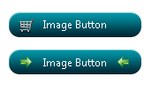

# Image Button

**RadButton** provides an easy way to show a custom image on the control.The image can be used as a background, or can represent the button itself (Image Button).When using the **RadButton** control as an Image Button, the user must set **Width** and **Height**, because we don't use an actual `` tag, but the image is set as background to the Button's wrapper element (`<span>`). All the Image-related properties are controlled through the **RadButton.Image** property.

>caption Figure 1: RadButton used as ImageButton (the image represents the button).



>caption Figure 2: RadButton with background image, icons and text.



There are two ways to display an image on the control:

1. The first and the easiest way is to set the **Image.ImageUrl** property to the location of the image used. Setting the **IsBackgroundImage** to true enables the developer to use the image as background, and set text and icons to his/her button.

1. The second way to set the image using **RadButton**'s **CssClass** property. Basically we set the background-image in the **CssClass**, and enable the image button functionality by setting **Image.EnableImageButton=true** (**Example 1**).

This approach is preferred when you want to use an image sprite for the button (see sample below). You set the background-image and background-position in the **CssClass**, and then in the **HoveredCssClass** and **PressedCssClass**, only the background-position of the hovered and pressed image. If the user wants she/he can display adifferent image when the mouse is hovering over the control, or the button is pressed using the **HoveredImageUrl** and **PressedImageUrl** properties respectively.

>caption Example 1: Configure a RadButton as an Image Button through the **CssClass** and **Image.EnableImageButton=true** properties.

````CSS
<style type="text/css">
	.classImage
	{
		background: url(img/categories.png);
		background-position: 0 0;
		width: 150px;
		height: 94px;
	}
	
	.classHoveredImage
	{
		background-position: 0 -100px;
	}
	
	.classPressedImage
	{
		background-position: 0 -200px;
	}
</style>
````

````ASP.NET
<telerik:RadButton RenderMode="Lightweight" ID="RadButton1" runat="server" Text="Image Button" CssClass="classImage"
    HoveredCssClass="classHoveredImage" PressedCssClass="classPressedImage">
    <Image EnableImageButton="true" />
</telerik:RadButton>
````

>note It is always good to set the **Text** property, no matter if the control is used solely as image button (no text and icons shown), because this way the accessibility of the control is improved.

## See Also

 * [Button - Image Buttons](https://demos.telerik.com/aspnet-ajax/button/examples/imagebutton/defaultcs.aspx)

 * [Button Types Overview]()

 * [Icons Overview]()

 * [Split Button]()

 * [Toggle button]()
 
