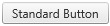
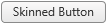

# Button Types Overview

**RadButton**'s **ButtonType** property controls how the button is rendered on the client, the styles that get applied to the control, and the features that are provided by each **RadButtonType**. Four options exist for the button type: **StandardButton** (default), **LinkButton**,**SkinnedButton** and **ToggleButton**.

1. [Configure RadButton as a StandardButton](#configure-radbutton-as-a-standardbutton)

1. [Configure RadButton as a LinkButton](#configure-radbutton-as-a-linkbutton)

1. [Configure RadButton as a ToggleButton](#configure-radbutton-as-a-togglebutton)

1. [Configure RadButton as a SkinnedButton](#configure-radbutton-as-a-skinnedbutton)

## Configure RadButton as a StandardButton

**StandardButton** (**Figure 1**). The control is rendered as `<input/>` of *type="submit"* or *type="button"*. The **UseSubmitBehavior** (default value "true" ) property determines whether the `<input/>` type will be "submit" (when set to true) or "button" (when set to false). The user can disable the built-in styles and CSS of the button, and let the client browser apply its default styling for `<input type="submit|button" />` elements, by setting the **EnableBrowserButtonStyle** property to true. **StandardButton** specific properties:

1. **UseSubmitBehavior**
1. **EnableBrowserButtonStyle**

>caption Figure 1: RadButton configured as a StandardButton.



>caption Example 1: The code that creates **StandardButton** in **Figure 1**.

````ASP.NET
<telerik:RadButton RenderMode="Lightweight" ID="RadButton1" runat="server" Text="Standard Button" 
	ButtonType="StandardButton" UseSubmitBehavior="true" EnableBrowserButtonStyle="false" />
````

## Configure RadButton as a LinkButton

**LinkButton** (**Figure 2**). The control is rendered as a `<span/>` element with child `<span/>` element used to specify the text. The purpose of this button type is to provide a "LinkButton" look of the control and enable the user to specify URL to navigate to without requiring a page postback to the server. You can specify a target window or frame, in which the Web page content will be displayed, when you click the control through the **Target** property. **LinkButton** specific properties:

1. **NavigateUrl**
1. **Target**

>caption Figure 2: RadButton configured as a LinkButton.


>caption Example 2: The code that creates **LinkButton** in **Figure 2**.

````ASP.NET
<telerik:RadButton RenderMode="Lightweight" ID="RadButton1" runat="server" Text="Link Button"
	ButtonType="LinkButton" NavigateUrl="https://www.telerik.com" Target="_blank" />
````

## Configure RadButton as a ToggleButton

**ToggleButton**. The control is rendered in the same way as the **LinkButton**, the difference is in the styles applied. The **ToggleButton** looks like a check box or radio button, depending on the value specified for the **ToggleType** property. It can also look like a simple text (label) button [clickable text], if **ToggleType** is set to "**None**" or "**CustomToggle**" is used. This button type should be used in scenarios when richly styled check boxes or radio buttons are needed. More information is available in the [Toggle button]() help article.

## Configure RadButton as a SkinnedButton

**SkinnedButton** (**Figure 3**). The control uses CSS3 for configuring rounded corners and gradient. This creates an appearance, similar to the **StandardButton**, without the need of sprite images. The **SkinnedButton** is rendered in the same way as the **LinkButton**.

>caption Figure 3: RadButton configured as a SkinnedButton.




>caption Example 3: The code that creates **SkinnedButton** in **Figure 3**.

````ASP.NET
<telerik:RadButton RenderMode="Lightweight" ID="RadButton1" runat="server" Text="Skinned Button" ButtonType="SkinnedButton" />
````

## See Also

 * [Split Button]()

 * [Icons Overview]()

 * [Image Button]()

 * [Toggle button]()
