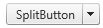

# Split Button

**RadButton** enables the developer to show an additional button next to the main button (**Figure 1**), whose purpose is to enhance the usability of the primary button. You can enable the split button functionality by setting the **EnableSplitButton** property to **true**.

>caption Figure 1: RadButton configured as a split button. The code that creates this figure is available in Example 1.



The extra button is rendered on the right (default) or the left,depending on the value set to the **SplitButtonPosition** property. The developer can also apply custom styling to the control using the **SplitButtonCssClass** property.

>caution It is not possible to have both **PrimaryIcon** and split button with **SplitButtonPosition** ="**Left**", enabled. The same is true for the **SecondaryIcon** and **SplitButtonPosition** ="**Right**".

## How to use the Split button functionality on the Client-side

You can handle the client-side [OnClientClicked]() or[OnClientClicking]() event, and then execute a desired action, depending on the clicked button by the user. See a sample in **Example 1**.

>caption Example 1: Utilizing the split button functionality on the client-side.

````ASP.NET
<telerik:RadButton RenderMode="Lightweight" ID="SplitButton1" Text="SplitButton" runat="server" EnableSplitButton="true"
	OnClick="SplitButton1_Click" OnCommand="SplitButton1_Command">
</telerik:RadButton> 
````

````JavaScript
function OnClientClicked(sender, args) {
	if (args.IsSplitButtonClick()) {
		//TODO: Execute SplitButton logic
		alert("Split button clicked!");
	} else {
		//TODO: Execute main button logic
		alert("Main button clicked!");
	}
}
````

## How to use the Split button functionality on the Server-side

The server-side Click and Command events can be handled to execute "split button" specific logic.The event arguments parameter should be cast to the respective ButtonClick or ButtonCommand event args, so thatwe can determine which button issued the click. You can find a simple project in **Example 2**.

>caption Example 2: Utilizing the split button functionality on the server-side.

````ASP.NET
<telerik:RadButton RenderMode="Lightweight" EnableSplitButton="true" ID="SplitButton" AutoPostBack="false" runat="server" 
	Text="Transfer Item" OnClientClicked="OnClientClicked">
</telerik:RadButton> 
````

````C#
protected void SplitButton1_Command(object sender, CommandEventArgs e)
{
	Telerik.Web.UI.ButtonCommandEventArgs args = e as Telerik.Web.UI.ButtonCommandEventArgs;
	
	if (args.IsSplitButruytonClick)
	{
	 //TODO: Split button logic
	}
}
protected void SplitButton1_Click(object sender, EventArgs e)
{
	Telerik.Web.UI.ButtonClickEventArgs args = e as Telerik.Web.UI.ButtonClickEventArgs;
	
	if (args.IsSplitButtonClick)
	{
	 //TODO: Split button logic
	}
} 
````
````VB
Protected Sub SplitButton1_Command(ByVal sender As Object, ByVal e As CommandEventArgs)
	Dim args As Telerik.Web.UI.ButtonCommandEventArgs = TryCast(e, Telerik.Web.UI.ButtonCommandEventArgs)
	
	If args.IsSplitButtonClick Then
		'TODO: Split button logic
	End If
End Sub

Protected Sub SplitButton1_Click(ByVal sender As Object, ByVal e As EventArgs)
	Dim args As Telerik.Web.UI.ButtonClickEventArgs = TryCast(e, Telerik.Web.UI.ButtonClickEventArgs)
	
	If args.IsSplitButtonClick Then
		'TODO: Split button logic
	End If
End Sub
````


## See Also

 * [Button Types Overview]()

 * [Icons Overview]()

 * [Image Button]()

 * [Toggle button]()
