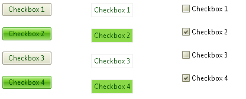
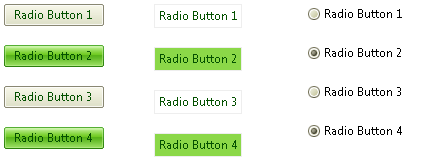
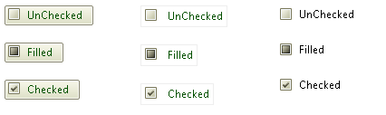

# Toggle button

The **RadButton** control can be easily configured to behave as a toggle button. Simply set the **ToggleType** property to a value different than **ButtonToggleType.None**, and the button is transformed into a check box, a radio button or a completely customized toggle button. Since the **ButtonType** property controls how the component looks like, the user can have his/her buttons look like standard buttons or even `<input type="submit|button" />` elements, and behave like check boxes or radio buttons. Here are some code samples showing how this is achieved:

* [Configure RadButton Controls as CheckBoxes](#configure-radbutton-controls-as-checkboxes)

* [Configure RadButton Controls as Radio Buttons](#configure-radbutton-controls-as-radio-buttons)

* [Configure a RadButton Control with Custom Toggle States](#configure-a-radbutton-control-with-custom-toggle-states)

## Configure RadButton Controls as CheckBoxes

In order to configure the **RadButton** as a checkbox you must do the following steps:

1. Set the **ToggleType** property of the button to "**CheckBox**".

1. Choose the desired button type through the **ButtonType** property:
	* **StandardButton** - For a standard button layout.
	* **LinkButton** - For link button layout.
	* **ToggleButton** - For a native checkbox layout.

1. Define whether the checkbox is checked or not through the **Checked** property.

1. You can make a further customization to both toggle states through the correspondingproperties (e.g., **Text**, **Value**,**Selected**, **CssClass**, etc.) of the **RadButtonToggleState** class.

>caption Example 1: Configuring RadButton as a checkbox with a **StandardButton**,**LinkButton** and **ToggleButton** button type.

````ASP.NET
<telerik:RadButton RenderMode="Lightweight" ID="btnToggle1" runat="server" Text="Checkbox 1" ToggleType="CheckBox"
	ButtonType="StandardButton"></telerik:RadButton>
	
<telerik:RadButton RenderMode="Lightweight" ID="btnToggle2" runat="server" Text="Checkbox 2" ToggleType="CheckBox" 
	ButtonType="LinkButton"></telerik:RadButton>

<telerik:RadButton RenderMode="Lightweight" ID="btnToggle2" runat="server" Text="Checkbox 3" ToggleType="CheckBox" 
	ButtonType="ToggleButton"></telerik:RadButton> 
````

>caption Figure 1: RadButton's checkbox functionality is relevant not only for a native checkbox appearance but also fora StandardButton and LinkButton button types.



## Configure RadButton Controls as Radio Buttons

In order to configure the **RadButton** as a radio button you must do the following steps:

1. Set the **ToggleType** property of the button to "**Radio**".

1. Choose the desired button type through the **ButtonType** property:
	* **StandardButton** - For a standard button layout.
	* **LinkButton** - For link button layout.
	* **ToggleButton** - For a native radio button layout.

1. Define whether the radio button is checked or not through the **Checked** property.

1. Set a common value for the **GroupName** property of the radio buttons that are within the same group.

1. You can make a further customization to both toggle states through the corresponding properties (e.g., **Text**, **Value**, **Selected**, **CssClass**, etc.) of the **RadButtonToggleState** class.

>caption Example 2: Configuring RadButton as a radio button with a **StandardButton**, **LinkButton** and **ToggleButton** button type.

````ASP.NET
<telerik:RadButton RenderMode="Lightweight" ID="btnToggle1" runat="server" Text="Radio Button 1" ToggleType="Radio" 
	ButtonType="StandardButton"></telerik:RadButton>

<telerik:RadButton RenderMode="Lightweight" ID="btnToggle2" runat="server" Text="Radio Button 2" ToggleType="Radio" 
	ButtonType="LinkButton"></telerik:RadButton>

<telerik:RadButton RenderMode="Lightweight" ID="btnToggle3" runat="server" Text="Radio BUtton 3" ToggleType="Radio" 
	ButtonType="ToggleButton"></telerik:RadButton> 
````

>caption Figure 2: RadButton's radio button functionality is relevant not only for a native radio button's appearance but also for a StandardButton and LinkButton button types.



## Configure a RadButton Control with Custom Toggle States

In order to configure a **RadButton** with custom toggle states you must do the following steps:

1. Set the **ToggleType** property of the button to "**CustomToggle**".

1. Choose the desired button type through the **ButtonType** property:
	* **StandardButton** - For a standard button layout.
	* **LinkButton** - For link button layout.
	* **ToggleButton** - For a native layout.

1. Add as many **RadButtonToggleState** instances as you like to the **ToggleStates** collection. Make a further customization to each toggle state through the corresponding properties (e.g., **Text**, **Value**, **Selected**, **CssClass**, etc.) of the **RadButtonToggleState** class.

>caption Example 3: Configuring RadButton with custom toggles states with a **StandardButton**, **LinkButton** and **ToggleButton** button type.

````ASP.NET
<telerik:RadButton RenderMode="Lightweight" ID="btnToggle1" runat="server" ToggleType="CustomToggle" ButtonType="StandardButton">
	<ToggleStates>
	 <telerik:RadButtonToggleState Text="UnChecked" PrimaryIconCssClass="rbToggleCheckbox" />
	 <telerik:RadButtonToggleState Text="Filled" PrimaryIconCssClass="rbToggleCheckboxFilled" />
	 <telerik:RadButtonToggleState Text="Checked" PrimaryIconCssClass="rbToggleCheckboxChecked" />
	</ToggleStates>
</telerik:RadButton>

<telerik:RadButton RenderMode="Lightweight" ID="btnToggle1" runat="server" ToggleType="CustomToggle" ButtonType="LinkButton">
	<ToggleStates>
	 <telerik:RadButtonToggleState Text="UnChecked" PrimaryIconCssClass="rbToggleCheckbox" />
	 <telerik:RadButtonToggleState Text="Filled" PrimaryIconCssClass="rbToggleCheckboxFilled" />
	 <telerik:RadButtonToggleState Text="Checked" PrimaryIconCssClass="rbToggleCheckboxChecked" />
	</ToggleStates>
</telerik:RadButton>

<telerik:RadButton RenderMode="Lightweight" ID="btnToggle1" runat="server" ToggleType="CustomToggle" ButtonType="ToggleButton">
	<ToggleStates>
	 <telerik:RadButtonToggleState Text="UnChecked" PrimaryIconCssClass="rbToggleCheckbox" />
	 <telerik:RadButtonToggleState Text="Filled" PrimaryIconCssClass="rbToggleCheckboxFilled" />
	 <telerik:RadButtonToggleState Text="Checked" PrimaryIconCssClass="rbToggleCheckboxChecked" />
	</ToggleStates>
</telerik:RadButton> 
````


>caption Figure 3: RadButton's custom toggle state functionality is relevant also for a StandardButton and LinkButton button types.



In the code above, the **PrimaryIconCssClass**property is used to specify a three-state (3-state) checkbox, and the Text property to have different text depending on the currently selected state.

To take a closer look at **RadButton**'s "toggle button" functionality please visit our [online demos](http://demos.telerik.com/aspnet-ajax/button/examples/togglebutton/defaultcs.aspx).


## See Also

 * [Button - Toggle Button Online Demo](http://demos.telerik.com/aspnet-ajax/button/examples/togglebutton/defaultcs.aspx)

 * [Button Types Overview]()

 * [Split Button]()

 * [Icons Overview]()

 * [Image Button]()