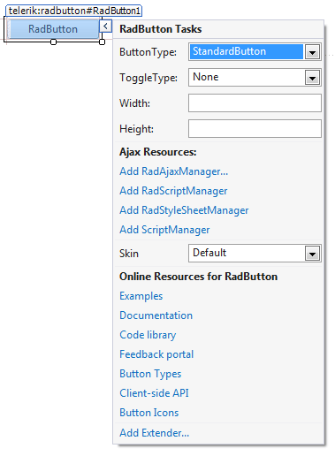

# Design Time

The Smart Tag of __RadButton__ (__Figure 1__) lets you configure your control or quickly get help. You can display theSmart Tag by right clicking on a __RadButton__ control and choosing "Show Smart Tag", orclicking the small rightward-pointing arrow located in the upper right corner of the control.
>caption Figure 1: RadButton's smart tag.

## Ajax Resources

* __Add RadAjaxManager...__ adds a __RadAjaxManager__ component to your Web page.

* __Add RadScriptManager__ adds a __RadScriptManager__ component to your Web page.

* __Add RadStyleSheetManager__ adds a __RadStyleSheetManager__ component to your Web page.

* __Add ScriptManager__ adds a __ScriptManager__ component to your Web page.

## Skin

The __Skin__ drop-down displays a list of available [skins]()that you can apply to your control, along with an example of what the __RadButton__ control looks like for each skin.Assign a skin by selecting the one you want from the list.

## Learning Center

* Links navigate you directly to examples, help, and code library.

* You can navigate directly to the [Telerik Support Center](http://www.telerik.com/support/home.aspx).
