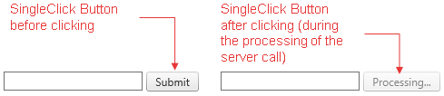

# Single Click Button


## 

The single click button (**Figure 1**) is used to avoid multiple postbacks/callbacks to the server. This feature is useful in databaseand/or e-mail send scenarios when the developer should prevent submitting of identical content multiple times to the server.
>caption Figure 1: RadButton with SingeClick functionality before and after click.



The following properties should be used to enable the single click functionality:

* **SingleClick** - determines whether the **RadButton** controlwill be immediately disabled after the user clicks it.Set it to **true** to enable the single click functionality.

* **SingleClickText** - determines the text displayed inthe **RadButton** control after the button is being clicked and disabled.

The **Example 1** below demonstrates how to setup a single click **RadButton**.

**Example 1**: The code that enables the single click functionality in **RadButton** from **Figure 1**.


````ASPNET
			<asp:TextBox ID="txtName" runat="server" />
			<telerik:RadButton ID="btnSubmit" runat="server" Text="Submit" OnClick="btnSubmit_Click"
				SingleClick="true" SingleClickText="Processing...">
			</telerik:RadButton>
			<asp:Label ID="lblGreeting" runat="server" />
````
````C#
		protected void btnSubmit_Click(object sender, EventArgs e)
		{
			if (Page.IsPostBack) System.Threading.Thread.Sleep(3000);
			lblGreeting.Text = String.Format("Hello, {0}!", txtName.Text);
		}
````
````VB
		Protected Sub btnSubmit_Click(sender As Object, e As System.EventArgs) Handles btnSubmit.Click
			If Page.IsPostBack Then
				System.Threading.Thread.Sleep(3000)
			End If
			lblGreeting.Text = String.Format("Hello, {0}!", txtName.Text)
		End Sub
````


The submitted text in processed on the server-side. Note that the method **System.Threading.Thread.Sleep**	is used so that the disabled button can be examined after clicking it.

# See Also

 * [Single Click Button Demo](http://demos.telerik.com/aspnet-ajax/button/examples/singleclick/defaultcs.aspx)
