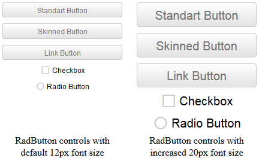
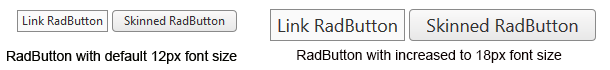

# Elastic Design

This article explains the **elastic design capabilities RadButton offers**. The examples below show the basic approaches you can use to scale the control by only changing its default font size.

Generally, responsive design means that the page and its content are able to adapt to different screen resolutions without deteriorating the user experience. This often includes changing the font size and having dimensions set in percent.

## Elastic Design with Lightweight Render Mode

The [Lightweight Render Mode]() is available since **Q1 2015**.

>caption Figure 1: Comparison between appearance of a RadButton with Lightweight render mode with regular font size and with increased font size



>caption Example 1: Shows how to increase the font size of a RadButton with Lightweight render mode as shown in Figure 1.

````ASP.NET
<style type="text/css">
	button.RadButton,
	span.RadButton {
		font-size: 20px;
	}
</style>

<telerik:RadButton runat="server" ID="StandartButton" RenderMode="Lightweight"
	Text="Standart Button" ButtonType="StandardButton" Skin="Silk" Width="200px">
</telerik:RadButton>

<telerik:RadButton runat="server" ID="SkinnedRadButton" RenderMode="Lightweight"
	Text="Skinned Button" ButtonType="SkinnedButton" Skin="Silk" Width="200px">
</telerik:RadButton>

<telerik:RadButton runat="server" ID="LinkRadButton" RenderMode="Lightweight"
	Text="Link Button" ButtonType="LinkButton" Skin="Silk" Width="200px">
</telerik:RadButton>

<telerik:RadButton runat="server" ID="Checkbox" RenderMode="Lightweight"
	Text="Checkbox" ButtonType="ToggleButton" ToggleType="CheckBox" Skin="Silk" Width="200px">
</telerik:RadButton>

<telerik:RadButton runat="server" ID="RadioButton" RenderMode="Lightweight"
	Text="Radio Button" ButtonType="ToggleButton" ToggleType="Radio" Skin="Silk" Width="200px">
</telerik:RadButton>
````

## Elastic Design with Classic Render Mode

>caption Figure 2: Comparison between appearance of a RadButton with Classic render mode with regular font size and with increased font size



**RadButton** with Classic render mode provides two [Button Types]() that are built semantically, using CSS for defining rounded corners, shadows and gradients.They are **LinkButton** and **SkinnedButton**.In the example below you will find a basic approach that enables you to resize and scale these buttons only by changing the default font size.

>caption Example 2: Shows how to increase the font size of a RadButton with Lightweight render mode as shown in Figure 2.

````ASP.NET
<style type="text/css">
	span.RadButton
	{
		font-size: 18px;
	}
</style>

<telerik:RadButton ID="RadButton1" runat="server" Text="Link RadButton" ButtonType="LinkButton">
</telerik:RadButton>

<telerik:RadButton ID="RadButton2" runat="server" Text="Skinned RadButton" ButtonType="SkinnedButton">
</telerik:RadButton>
````

**RadButton** does not create elastic design by itself, but can fit in a page that follows this pattern. This elastic layout is achieved by using `em` units for setting dimensions and paddings in the control, instead of `px`because `em` units are tied to the font size. This allows dimensions and sizes to scale with the font size.

Elements that use images or images sprites, however, cannot be increased in size, so if you are using any icons they will keep having their original dimensions and position.The horizontal aligning of the icons also has to be handled manually.

## See Also

 * [Mobile Support Overview]()

 * [Render Modes]()

 * [Fluid Design]()

 * [Button Types]()
