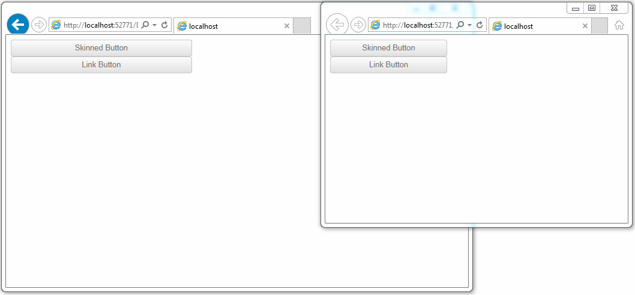

# Fluid Design

This article explains the **fluid design capabilities RadButton offers**. The examples below show how you can set its size in percent so it can resize with its parent element.

Generally, responsive design means that the page and its content are able to adapt to different screen resolutions without deteriorating the user experience. This often includes [changing the font size]() and having dimensions set in percent.

## Fluid Design with Lightweight Render Mode

The [Lightweight Render Mode]() is available since **Q1 2015**.

>caption Figure 1: RadButton with Lightweight render mode set to 100% width and height


>caption Example 1: Shows the markup that provides fluid design of the RadButton in Figure 1.

````ASP.NET
<style>
	html, body, form {
		height:100%;
	}
</style>

<div style="width:40%; height:30%;">
	<telerik:RadButton runat="server" ID="StandartButton" RenderMode="Lightweight"
		Text="Standart Button" ButtonType="StandardButton" Skin="Silk" Width="100%" Height="25%">
	</telerik:RadButton>

	<telerik:RadButton runat="server" ID="SkinnedRadButton" RenderMode="Lightweight"
		Text="Skinned Button" ButtonType="SkinnedButton" Skin="Silk" Width="100%" Height="25%">
	</telerik:RadButton>

	<telerik:RadButton runat="server" ID="LinkRadButton" RenderMode="Lightweight"
		Text="Link Button" ButtonType="LinkButton" Skin="Silk" Width="100%" Height="25%">
	</telerik:RadButton>

	<telerik:RadButton runat="server" ID="Checkbox" RenderMode="Lightweight"
		Text="Checkbox" ButtonType="ToggleButton" ToggleType="CheckBox" Skin="Silk" Width="100%" Height="25%">
	</telerik:RadButton>

	<telerik:RadButton runat="server" ID="RadioButton" RenderMode="Lightweight"
		Text="Radio Button" ButtonType="ToggleButton" ToggleType="Radio" Skin="Silk" Width="100%" Height="25%">
	</telerik:RadButton>
</div>
````

## Fluid Design with Classic Render Mode

>caption Figure 2: RadButton with Classic render mode set to 100% width



**RadButton** with Classic render mode provides two [Button Types]() that can be used with fluid width (e.g., *Width="100%"*).They are **LinkButton** and **SkinnedButton**.In the example below you will find a basic approach that configures the button to inherit the parent's width.

>caption Example 2: Shows the markup that provides fluid design of the RadButton in Figure 2.

````ASP.NET
<div style="width:40%; height:30%;">
	<telerik:RadButton runat="server" ID="SkinnedRadButton" Text="Skinned Button" 
		ButtonType="SkinnedButton" Skin="Silk" Width="100%">
	</telerik:RadButton>

	<telerik:RadButton runat="server" ID="LinkRadButton" Text="Link Button" 
		ButtonType="LinkButton" Skin="Silk" Width="100%">
	</telerik:RadButton>
</div>
````

## See Also

 * [Mobile Support Overview]()

 * [Render Modes]()

 * [Elastic Design]()

 * [Button Types]()
