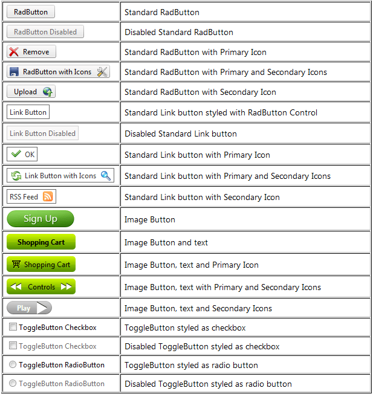

# Button Overview

The **RadButton** control (**Figure 1**) provides the features, that ASP.NET Button, ImageButton, LinkButton, RadioButton and CheckBox controls have. The control can be easily styled by changing the **Skin** property, and alternatively setting properties that change the look of the control. This will eliminate the need to use the [RadFormDecorator](), just to style a single button. 

## Migration from the standard ASP.NET Button, Link and Image controls
Developers can easily migrate their applications from using the standard ASP.NET (button) controls to the new **RadButton** control, because most of their functionality is provided by our control, and is controlled by the same or similar (intuitive) properties.

>caption Figure 1: RadButton control provides a versatile set of button types.

## See Also

 * [RadButton Online Demos](https://demos.telerik.com/aspnet-ajax/button/examples/overview/defaultcs.aspx)
 
 * [RadButton Getting Started]()
 
 * [Properties and Events]()
 
 * [FormDecorator Overview]()
