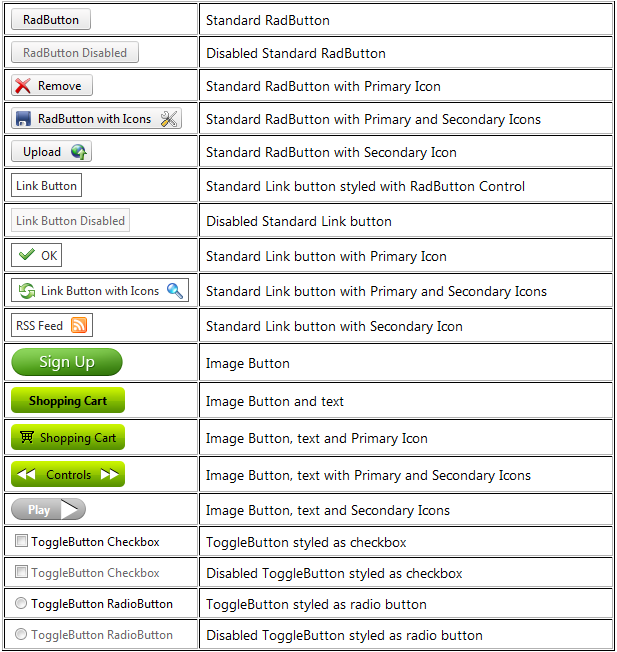

# Telerik's ASP.NET Button Overview

## RadButton for ASP.NET AJAX overview

The __RadButton__ control (__Figure 1__) provides the features, that ASP.NET Button, ImageButton, LinkButton, RadioButton and CheckBox controls have. The control can be easily styled by changing the __Skin__ property, and alternativelysetting properties that change the look of the control. This will eliminate the need to use the[RadFormDecorator](4F3D6E83-A8FB-4DE9-9DDD-D007366B31B9),just to style a single button. Developers can easily migrate their applications from using the standard ASP.NET (button)controls to the new __RadButton__ control, because most of their functionality is provided by our control, and is controlledby the same or similar(intuitive) properties.

>caption Figure 1: RadButton control provides a versatile set of button types.

# See Also

 * [RadButton Online Demos](http://demos.telerik.com/aspnet-ajax/button/examples/overview/defaultcs.aspx)

 * [RadButton Getting Started]()

 * [Properties and Events]()
