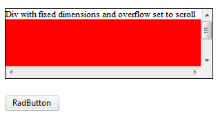
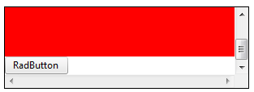

# RadButton Known Issues in IE6 and IE7

## Problem

When a **RadButton** is placed inside an overflow box, it appears outside that box' boundaries (**Figure 1**).

## Description:

Applies to:

* CSS

* (X)HTML

* IE6 and IE7

Internet Explorer 6/7 incorrectly overlays the relatively positioned element over all other elements on the page, giving it a "fixed" appearance when scrolling inside an overflow box. **RadButton's** wrapping element (a span, <span>) is relatively positioned, in order to position the Primary and Secondary icons absolutely toward the wrapping element.So, if you have a **RadButton** control in an HTML element with fixed width and height, and overflow set to scroll, you will observe this behavior in IE 6 and 7.

The result in IE6/7:

>caption Figure 1: A RadButton appears outside the box' boundaries when placed inside an overflow box in IE6/IE7.



When the internal content is higher than the wrapping div height it comes out of instead to be scrollable.The code used for **Figure 1** is shown in **Example 1**.

>caption Example 1: The code that creates **Figure 1**.

````ASP.NET
<div style="width: 300px; height: 100px; border: 1px solid #000; overflow: scroll;
	font-size: 13px;">
	<span>Div with fixed dimensions and overflow set to scroll</span>
	<div style="height: 110px; background: #f00;">
	</div>
	<telerik:RadButton RenderMode="Lightweight" ID="RadButton" runat="server" Text="RadButton">
	</telerik:RadButton>
</div> 
````

## Solution:

The simplest fix is to apply position: relative to the containing block; the one with **overflow: scroll**(**Figure 2**).

>caption Figure 2: Setting position: relative to the RadButton's wrapper element that has overflow: scroll fixes the issue from Figure 1.



*Now the relatively positioned element is inside the scrollable element*

The code for the fixed example is displayed in **Example 2**.

>caption Example 2: The code that fixes the overflow issue of the button from **Figure 1**.

````ASP.NET
<div style="width: 300px; height: 100px; border: 1px solid #000; overflow: scroll; position: relative;
	font-size: 13px;">
	<span>Div with fixed dimensions and overflow set to scroll</span>
	<div style="height: 110px; background: #f00;">
	</div>
	<telerik:RadButton RenderMode="Lightweight" ID="RadButton" runat="server" Text="RadButton">
	</telerik:RadButton>
</div> 
````

## See Also

 * [RadButton Not Performing Postback]()

 * [Event Handlers Are Not Raised]()

 * [Client-side Click Event Handler Is Not Executed]()
