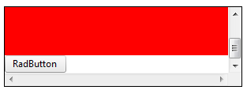

# RadButton Known Issues in IE6 and IE7


## Problem

When a __RadButton__ is placed inside an overflow box, it appearsoutside that box' boundaries (__Figure 1__).


## Description:

Applies to:

* CSS

* (X)HTML

* IE6 and IE7

Internet Explorer 6/7 incorrectly overlays the relatively positioned element over all otherelements on the page, giving it a "fixed" appearance when scrolling inside anoverflow box. __RadButton's__ wrappingelement (a span, <span>) is relativelypositioned, in order to position the Primary and Secondary icons absolutely toward the wrapping element.So, if you have a __RadButton__ control in an HTML element with fixed width andheight, and overflow set to scroll, you will observe this behavior in IE 6 and 7.

The result in IE6/7:
>caption Figure 1: A RadButton appears outside the box' boundaries when placed inside an overflow box in IE6/IE7.


When the internal content is higher than the wrapping div height it comes out of instead to be scrollable.The code used for __Figure 1__ is shown in __Example 1__.

__Example 1__: The code that creates __Figure 1__.

````ASPNET
	<div style="width: 300px; height: 100px; border: 1px solid #000; overflow: scroll;
	 font-size: 13px;">
	 <span>Div with fixed dimensions and overflow set to scroll</span>
	 <div style="height: 110px; background: #f00;">
	 </div>
	 <telerik:RadButton ID="RadButton" runat="server" Text="RadButton">
	 </telerik:RadButton>
	</div> 
````


## Solution:

The simplest fix is to apply position: relative to the containing block; the one with __overflow: scroll__(__Figure 2__).
>caption Figure 2: Setting position: relative to the RadButton's wrapper element that has overflow: scroll fixes the issue from Figure 1.



*Now the relatively positioned element is inside the scrollable element*

The code for the fixed example is displayed in __Example 2__.

__Example 2__: The code that fixes the overflow issue of the button from __Figure 1__.

````ASPNET
	<div style="width: 300px; height: 100px; border: 1px solid #000; overflow: scroll; position: relative;
	font-size: 13px;">
	<span>Div with fixed dimensions and overflow set to scroll</span>
	<div style="height: 110px; background: #f00;">
	</div>
	<telerik:RadButton ID="RadButton" runat="server" Text="RadButton">
	</telerik:RadButton>
	</div> 
````


# See Also

 * [RadButton Not Performing Postback]()

 * [Event Handlers Are Not Raised]()

 * [Client-side Click Event Handler Is Not Executed]()
