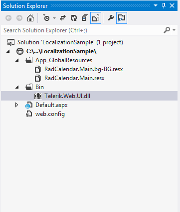

# Localization Through Global Resources


__RadCalendar__ and all the picker controls support built-in localization through global resources. Similar to other __RadControls__, you can use the __.resx__files to localize the control with minimal efforts. For that purpose, you can include the localization files in the __App_GlobalResources__ folder in yourapplication and change the __Culture__ property of the control.

## Using Localization Files

According to the control you want to localize you should use/create a combination of .resx files. __Table 1__ describes controls and files which should be used for localization.


|  __RadControl__  |  __Resource files__  |
| ------ | ------ |
| __RadCalendar__ |RadCalendar.Main.resx|
| __RadDatePicker__ |RadCalendar.Main.resx,RadDatePicker.Main.resx|
| __RadDateTimePicker__ |RadCalendar.Main.resx,RadDateTimePicker.Main.resx|
| __RadTimePicker__ |RadDateTimePicker.Main.resx|
| __RadMonthYearPicker__ |RadMonthYearPicker.Main.resx|

The resource files should be placed within the __App_GlobalResources__ folder in your application. You can either create your own language pack(see below) or use an existing one(if available for your language). The controls installation wizard automatically copies the built-in resources to the App_GlobalResources in your local installation.

__Figure 1__: Location of the localization files after the installation

To change the current language/resource you should set the Culture property accordingly.

>caution  __RadCalendar's__ default Culture is taken from the page's __CurrentUICulture__ .
>


````XML
	        <telerik:RadCalendar  ID="RadCalendar1" runat="server" Culture="en-US" ... </telerik:RadCalendar>
````


Here is how to localize your RadCalendar in simple steps:

1. Create a new resource file or copy an existing one from the __App_GlobalResources__ in your installation folder

1. Add the resource file(__.resx__) file to the __App_GlobalResources__ folder in your application.Note that you should have two files as a bare minimum - __RadCalendar.Main.resx__ and the localization file itself - for example __RadCalendar.Main.bg-BG.resx__

1. Set the __Culture__ property to the corresponding language (for example: bg-BG,it-IT, en-GB, ja-JP and so on)

__Figure 2__: Location of the localization files in the Solution Explorer

## Creating/Modifying Resource files

The resource files are represented in a human-readable format (XML) and can be easily modified either in the	built-in Visual Studio resource editor or directly in the file, by hand.

__Figure 3__: Localization file opened in a text editor

__Figure 4__: Localization file opened in Visual Studio

In order to create a new localization file you can follow the steps listed below:

1. Make a copy of the __RadCalendar.Main.resx__ file and save it as __RadCalendar.Main.YOURLANGUAGE.resx__ (for example: __RadCalendar.Main.ja-JP.resx__)

1. Replace the default strings with the translated ones

1. Set the __Culture__ property of the control to the relevant language

>caution Please __ -do not- __ modify/remove the __ReservedResource__ key.
>


>note We encourage that you submit your localized resource files in the[Localization code library section](http://www.telerik.com/community/code-library/aspnet-ajax/localization.aspx)
>


You can find a complete list of the culture codes [here](http://sharpertutorials.com/list-of-culture-codes/).
