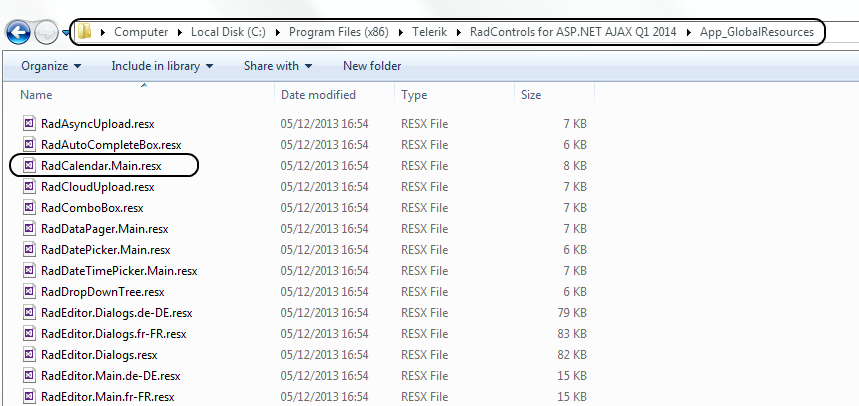

# Localization Through Global Resources


**RadCalendar** and all the picker controls support built-in localization through global resources. Similar to other **RadControls**, you can use the **.resx**files to localize the control with minimal efforts. For that purpose, you can include the localization files in the **App_GlobalResources** folder in yourapplication and change the **Culture** property of the control.

## Using Localization Files

According to the control you want to localize you should use/create a combination of .resx files. **Table 1** describes controls and files which should be used for localization.


|  **RadControl**  |  **Resource files**  |
| ------ | ------ |
| **RadCalendar** |RadCalendar.Main.resx|
| **RadDatePicker** |RadCalendar.Main.resx,RadDatePicker.Main.resx|
| **RadDateTimePicker** |RadCalendar.Main.resx,RadDateTimePicker.Main.resx|
| **RadTimePicker** |RadDateTimePicker.Main.resx|
| **RadMonthYearPicker** |RadMonthYearPicker.Main.resx|

The resource files should be placed within the **App_GlobalResources** folder in your application. You can either create your own language pack(see below) or use an existing one(if available for your language). The controls installation wizard automatically copies the built-in resources to the App_GlobalResources in your local installation.

**Figure 1**: Location of the localization files after the installation

To change the current language/resource you should set the Culture property accordingly.

>caution  **RadCalendar's** default Culture is taken from the page's **CurrentUICulture** .
>


````XML
	        <telerik:RadCalendar  ID="RadCalendar1" runat="server" Culture="en-US" ... </telerik:RadCalendar>
````


Here is how to localize your RadCalendar in simple steps:

1. Create a new resource file or copy an existing one from the **App_GlobalResources** in your installation folder

1. Add the resource file(**.resx**) file to the **App_GlobalResources** folder in your application.Note that you should have two files as a bare minimum - **RadCalendar.Main.resx** and the localization file itself - for example **RadCalendar.Main.bg-BG.resx**

1. Set the **Culture** property to the corresponding language (for example: bg-BG,it-IT, en-GB, ja-JP and so on)

**Figure 2**: Location of the localization files in the Solution Explorer

## Creating/Modifying Resource files

The resource files are represented in a human-readable format (XML) and can be easily modified either in the	built-in Visual Studio resource editor or directly in the file, by hand.

**Figure 3**: Localization file opened in a text editor

**Figure 4**: Localization file opened in Visual Studio

In order to create a new localization file you can follow the steps listed below:

1. Make a copy of the **RadCalendar.Main.resx** file and save it as **RadCalendar.Main.YOURLANGUAGE.resx** (for example: **RadCalendar.Main.ja-JP.resx**)

1. Replace the default strings with the translated ones

1. Set the **Culture** property of the control to the relevant language

>caution Please ** -do not- ** modify/remove the **ReservedResource** key.
>


>note We encourage that you submit your localized resource files in the[Localization code library section](http://www.telerik.com/community/code-library/aspnet-ajax/localization.aspx)
>


You can find a complete list of the culture codes [here](http://sharpertutorials.com/list-of-culture-codes/).
