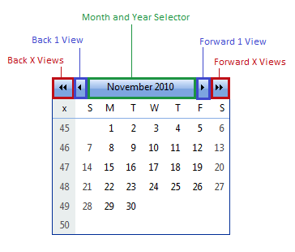

# RadCalendar Month Navigation

## 

The title bar of __RadCalendar__ includes the controls for navigating to other views.By default, each view represents a single month. However, if the calendar is using[Multi-View mode](), the view can includeany number of months.

The title bar includes three types of controls for switching views:

* __Back X Views/Forward X Views__ - The outermost controls, which appear as double arrow buttons ("<<" or ">>") move the current view by a fixed number of views, which is given by the __FastNavigationStep__ property. For example, in single view mode, if __FastNavigationStep__ is 3, then clicking the ">>" button moves forward three months. In [multi-view mode](), with two months showing, if FastNavigationStep is 3, then clicking the ">>" button moves forward six months.

* __Back 1 View/Forward 1 View__ - The single arrow buttons ("<" or ">") move the view back or forward by a single view. In single view mode, clicking these buttons changes the view by a single month. In multi-view mode, clicking these buttons changes the view by the number of months shown in a single view.

* __Month and Year Selector__ - Clicking on the title in the center of the title bar causes a popup to appear that lets the user navigate directly to a particular month or year. In the popup, the user can select a month and year, then click the __OK__ button to move to the view containing that month and year. Clicking the __Today__ button moves to the view containing the current date. Clicking the __Cancel__ button exits without changing the current view. The "<<" and ">>" buttons scroll through the possible years in the popup.

# See Also

 * [Navigation Controls Settings]()
