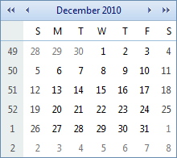
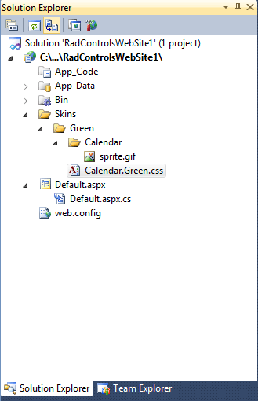
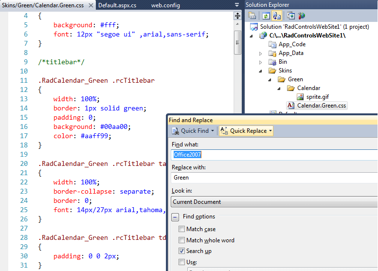
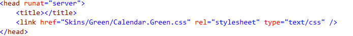

# Creating a Custom Skin


The following tutorial demonstrates how you can create custom **RadCalendar** skin, using the **Office2007** skin as base. The tutorial only changes skin CSS classes that affect the **RadCalendar** control.


This tutorial creates a new skin that takes the appearance of the calendar control from this look:



to the following:


See [Understanding the Skin CSS File]() for more information on specific CSS file properties.

## Prepare the Project

1. Drag a **RadCalendar** control from the toolbox onto a new AJAX-enabled application Web Form.

2. In the Solution Explorer, create new "Skins" folder in your project and then add a "Green" folder inside.

3. Copy the **Office2007** skin files of **RadCalendar** from the installation directory to the "Green" directory; copy both the **\Calendar** directory that contains the images for this skin and the **Calendar.Office2007.css** file that defines the skin styles. The file path will typically be similar to this - *\Program Files\Telerik\<Your Version of UI for ASP.NET.AJAX>\Skins\* 

4. In Solution Explorer, rename "**Calendar.Office2007.css**" to "**Calendar.Green.css**". Solution Explorer should now look something like the following:

You do not need the **Office2007.gif** file - this is a preview of the original **Office2007** skin, so you can safely delete it.

5. Open **Calendar.Green.css** and replace all instances of **_Office2007** with **_Green**. You can also edit the skin name in the CSS comment on the first line. Then save the file:


6. Drag the "**Calendar.Green.Css**" file from Solution Explorer onto your Web Page. This will automatically add a <link> tag as reference to the new stylesheet on the page <*head*>:


7. Change the **Skin** property of your **RadCalendar** control to **Green**.

8. Set the **EnableEmbeddedSkins** property of your **RadCalendar** control to **false**.

9. Run the application. The new **Green** skin looks just like the **Office2007** skin:


## Editing the CSS classes

1. The class that controls the overall appearance of the **RadCalendar** title bar is **rcTitlebar**. In the **Calendar.Green.css** file, locate the selector **.RadCalendar_Green .rcTitlebar** and change the border color to **green**, the **background** color to **#00aa00** and the font **color** to **#aaff99**:
````CSS
.RadCalendar_Green .rcTitlebar
{
    width:100%;
    border:1px solid green;
    padding:0;
    background:#00aa00;
    color:#aaff99;
}
````


2. Another CSS rule, which controls the title area is defined with the selector **.RadCalendar_Green .rcTitlebar table**. In this case the CSS rule adds a light blue border, which is not needed, so locate the rule and remove the border:
````CSS
.RadCalendar_Green .rcTitlebar table
{
    width:100%;
    border-collapse:separate;
    border:0;
    font:14px/27px arial,tahoma,sans-serif;
}
````


3. The main area of the calendar is wrapped in a table cell, which has the **rcMain** CSS class applied. This table cell contains a table with the **rcMainTable** class applied. Locate the two selectors: **.RadCalendar_Green .rcMain** and **.RadCalendar_Green .rcMainTable**, and change the **border** color to **green**, the **width** to **100%**, and remove the **margin** (set it to **0**):
````CSS
.RadCalendar_Green .rcMain
{
    width:100%;
    border:1px solid green;
    border-top:0;
    padding:0;
    background:#fff;
}
.RadCalendar_Green .rcMainTable
{
    border-collapse:separate;
    border:0;
    width:100%;
    margin:0;
    font:11px/15px arial,tahoma,sans-serif;
}
````


4. The row and column headers are <**th**> elements wrapped in table rows which have the following CSS classes applied: **rcRow** and **rcWeek** (respectively). Locate the selectors **.RadCalendar_Green .rcRow th** and **.RadCalendar_Green .rcWeek th**. Change the **color** to **#aaff99** so that the font matches the title bar. Add a rule for the background: "background: #66bb44;". Finally, remove the column headers' bottom border:
````CSS
.RadCalendar_Green .rcRow th,
.RadCalendar_Green .rcWeek th
{
    border:0;
    padding:0 6px;
    background:#66bb44;
    color:#aaff99;
    font-weight:normal;
    cursor:default;
}
.RadCalendar_Green .rcWeek th
{
    padding-top:4px;
    padding-bottom:3px;
    font-size:10px;
    text-align:right;
}
````


5. Locate the selector **.RadCalendar_Green .rcRow .rcHover**. The **.rcHover** class is applied to cells in the day matrix when the mouse hovers over them. Change the **background** color and **border-color** to **#eeffee**. In case you wonder why the border color is the same as the background color - this is the easiest way to make the border invisible. If we simply remove the border, **RadCalendar** will start flickering on mouse over, because the date cells have a white border by default. We can remove that also, but the skin modification will become more complex and this is out of the scope of this tutorial.
````CSS
.RadCalendar_Green .rcRow .rcHover
{
    border-color:green;
    background: #eeffee;
}
````


6. Locate the selector **.RadCalendar_Green .rcRow .rcHover a**. This provides a different color to the hovered dates. Remove this rule.

7. Locate the selectors **.RadCalendar_Green .rcRow .rcSelected** and **.RadCalendar_Green .rcRow .rcSelected a**. The **.rcSelected** class is applied to selected cells. On these two rules, change the **background** color and **border-color** to **#aaff99**, and set the font **color** to **#009900**:
````CSS
.RadCalendar_Green .rcRow .rcSelected
{
    border-color:#aaff99;
    background:#aaff99;
}
.RadCalendar_Green .rcRow .rcSelected a
{
    color:#009900;
}
````


8. Locate the selector **.RadCalendar_Green .rcRow .rcToday**. The **.rcToday** class is applied to the cell for the "today" special day. Change the border color to green and remove the CSS rule defined by the selector **.RadCalendar_Green .rcRow .rcToday a**:
````CSS
.RadCalendar_Green .rcRow .rcToday
{
    border-color:green;
}
````


9. The class that controls the cells for the non-current month is **rcOtherMonth**. The class for cells that are outside the valid range is **rcOutOfRange**. Create a new CSS rule that contains these classes and add a background color:
````CSS
.RadCalendar_Green .rcOtherMonth,
.RadCalendar_Green .rcOutOfRange
{
    background:#fafff8;
}
````


10. The class that controls the cells for weekend days is **.rcWeekend**. There is currently no rule for table cells with this class. Add the following:
````CSS
.RadCalendar_Green .rcWeekend
{
    background:#f8fff8;
}
````


11. The class that controls the cells for disabled days is **.rcDisabled**.There is currently no rule for this class. Add the following:
````CSS
.RadCalendar_Green .rcRow .rcDisabled
{
    color:#ccc;
}
````


12. The class for the popup month/year navigation control is **RadCalendarMonthView_Green**. Change the border color of the wrapper and selected month cells to green:
````CSS
table.RadCalendarMonthView_Green
{
    border-collapse:separate;
    border:1px solid green;
    background:#fff;
    font:10px verdana,tahoma,sans-serif;
    color:#333;
}
.RadCalendarMonthView_Green #rcMView_Feb,
.RadCalendarMonthView_Green #rcMView_Apr,
.RadCalendarMonthView_Green #rcMView_Jun,
.RadCalendarMonthView_Green #rcMView_Aug,
.RadCalendarMonthView_Green #rcMView_Oct,
.RadCalendarMonthView_Green #rcMView_Dec
{
    border-right:1px solid green;
}
````


13. Locate the selector **.RadCalendarMonthView_Green .rcButtons**. This controls the appearance of the bottom sections of the popup where the "Today", "OK", and "Cancel" buttons go. Change the **background** color and the top border color to **#ddffcd**:
````CSS
.RadCalendarMonthView_Green .rcButtons
{
    border:0;
    border-top:1px solid #ddffcd;
    padding:4px 6px;
    background:#ddffcd;
    text-align:center;
}
````


14. Locate the selector **.RadCalendarMonthView_Green input**. This controls the appearance of the "Today", "OK", and "Cancel" buttons. Change the **background** color to **green** and the color to **#ddffcd**:
````CSS
.RadCalendarMonthView_Green input 
{
    border:1px solid;
    border-color:#3a9f09 #2b7507 #2b7507 #3a9f09;
    padding:0;
    background:green;
    color:#ddffcd;
    font:10px verdana,arial,sans-serif;
    cursor:pointer;
}
````


15. Finally, you should edit the **sprite.gif** image located in the **\Green\Calendar\** folder, so that the navigation arrows become white (currently they are blue). Alternatively, you can use your own non-sprite images for **RadCalendar**. In this case you will either have to set **ImagesPath** to specify a common location for all images, or declare the location and filename of each image separately.When you run the application, **RadCalendar** should look as follows:


>note 
You may want to make changes to the base stylesheet of the **RadCalendar** control, which holds the rules that are common for all skins. In order to do so, you need to copy the **Calendar.css** file from the Skins folder in your installation directory to the **Skins** folder in your project. Then, you should register it in the *head* tag and modify it to meet your requirements. Note that, to see the changes, you need to set the **EnableEmbeddedBaseStylesheet** property of **RadCalendar** to **false** .
>


## See Also

 * [Telerik ThemeBuilder for ASP.NET AJAX](http://themebuilder.telerik.com/)


