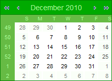
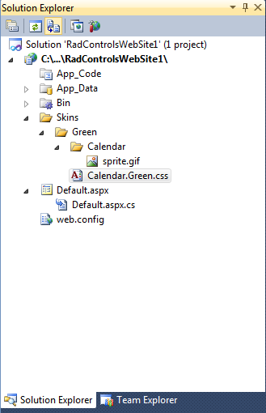

# Creating a Custom Skin


The following tutorial demonstrates creating a custom __RadCalendar__ skin, using the Office2007 skin as a base. The tutorial only changes skin CSS classes that affect the __RadCalendar__ control, although Calendar skins also include definitions for classes that affect the __RadDatePicker__, __RadDateTimePicker__, and __RadTimePicker__ controls as well.

>caution If you want to create a custom skin for the __RadDatePicker__ , __RadDateTimePicker__ , or __RadTimePicker__ controls, be aware that you must also create custom skin files for the Input skin, which is applied to the embedded __RadInput__ control.
>


This tutorial creates a new skin that takes the appearance of the calendar control from this look:

to the following:

See [Understanding the Skin CSS File]() for more information on specific CSS file properties.

## Prepare the Project

1. Drag a __RadCalendar__ control from the toolbox onto a new AJAX-enabled application Web form.

1. In the Solution Explorer, create a new "Skins" folder in your project and then a add a "Green" folder inside.

1. Copy the __RadCalendar__'s__Office2007__ skin files from the installation directory to the "Green" directory; copy both the \Calendar directory that contains the images for this skin and the Calendar.Office2007.css file that defines the skin styles.

>note The file path will typically be similar to this example: *\Program Files\Telerik\<Your Version of UI for ASP.NET.AJAX>\Skins\* 
>


1. In the Solution Explorer, rename "Calendar.Office2007.css" to "Calendar.Green.css". The Solution Explorer should now look something like the following:You do not need the  Office2007.gif file - this is a preview of the original Office2007 skin, so you can safely delete it.

1. Open Calendar.Green.css and replace all instances of _Office2007 with _Green. You can also edit the skin name in the CSS comment on the first line. Then save the file:

1. Drag the "Calendar.Green.Css" file from the Solution Explorer onto your Web page. This automatically adds a <link> tag as a reference to the new stylesheet in the page <head>:

1. Change the __Skin__ property of your __RadCalendar__ control to "Green".

1. Set the __EnableEmbeddedSkins__ property of your __RadCalendar__ control to "False".

1. Run the application. The new "Green" skin looks just like the Office2007 skin:

## Editing the CSS classes

1. The class that controls the overall appearance of the RadCalendar title bar is __rcTitlebar__. In the Calendar.Green.css file, locate the selector __.RadCalendar_Green .rcTitlebar__ and change the border color to "green", the background color to "#00aa00" and the font color to "#aaff99":

````XML
	.RadCalendar_Green .rcTitlebar
	{
	   width:100%;
	   border:1px solid green;
	   padding:0;
	   background:#00aa00;
	   color:#aaff99;
	}
````


1. Another CSS rule, which controls the title area is defined with the selector __.RadCalendar_Green .rcTitlebar table__. In this case the CSS rule adds a light blue border, which is not needed, so locate the rule and remove the border:

````XML
	.RadCalendar_Green .rcTitlebar table
	{
	   width:100%;
	   border-collapse:separate;
	   border:0;
	   font:14px/27px arial,tahoma,sans-serif;
	}
````


1. The main area of the calendar is wrapped in a table cell, which has the __rcMain__ CSS class applied. This table cell contains a table with the __rcMainTable__ class applied. Locate the two selectors: __.RadCalendar_Green .rcMain__ and __.RadCalendar_Green .rcMainTable__, and change the border color to green, the width to 100%, and remove the margin (set it to zero):

````XML
	.RadCalendar_Green .rcMain
	{
	   width:100%;
	   border:1px solid green;
	   border-top:0;
	   padding:0;
	   background:#fff;
	}
	.RadCalendar_Green .rcMainTable
	{
	   border-collapse:separate;
	   border:0;
	   width:100%;
	   margin:0;
	   font:11px/15px arial,tahoma,sans-serif;
	}
````


1. The row and column headers are <__th__> elements wrapped in table rows which have the following CSS classes applied: __rcRow__ and __rcWeek__ (respectively). Locate the selectors__.RadCalendar_Green .rcRow th__and __.RadCalendar_Green .rcWeek th__. Change the color to "#aaff99" so that the font matches the title bar. Add a rule for the background: "background: #66bb44;". Finally, remove the column headers' bottom border:

````XML
	.RadCalendar_Green .rcRow th,
	.RadCalendar_Green .rcWeek th
	{
	   border:0;
	   padding:0 6px;
	   background:#66bb44;
	   color:#aaff99;
	   font-weight:normal;
	   cursor:default;
	}
	.RadCalendar_Green .rcWeek th
	{
	   padding-top:4px;
	   padding-bottom:3px;
	   font-size:10px;
	   text-align:right;
	}
````


1. Locate the selector __.RadCalendar_Green .rcRow .rcHover__. The __.rcHover__ class is applied to cells in the day matrix when the mouse hovers over them. Change the background color and border color to "#eeffee". In case you wonder why the border color is the same as the background color - this is the easiest way to make the border invisible. If we simply remove the border, RadCalendar will start flickering on mouse over, because the date cells have a white border by default. We can remove that also, but the skin modification will become more complex and this is out of the scope of this tutorial.

````XML
	    .RadCalendar_Green .rcRow .rcHover
	{
	   border-color:green;
	   background: #eeffee;
	}
````


1. Locate the selector __.RadCalendar_Green .rcRow .rcHover a__. This provides a different color to the hovered dates. Remove this rule.

1. Locate the selectors __.RadCalendar_Green .rcRow .rcSelected__ and __.RadCalendar_Green .rcRow .rcSelected a__. The __.rcSelected__ class is applied to selected cells. On these two rules, change the background color and border color to "aaff99", and set the font color to "#009900":

````XML
	    .RadCalendar_Green .rcRow .rcSelected
	{
	   border-color:#aaff99;
	   background:#aaff99;
	}
	.RadCalendar_Green .rcRow .rcSelected a
	{
	   color:#009900;
	}
````


1. Locate the selector __.RadCalendar_Green .rcRow .rcToday__. The __.rcToday__ class is applied to the cell for the "today" special day. Change the border color to green and remove the CSS rule defined by the selector __.RadCalendar_Green .rcRow .rcToday a__:

````XML
	    .RadCalendar_Green .rcRow .rcToday
	{
	   border-color:green;
	}
````


1. The class that controls the cells for the non-current month is __rcOtherMonth__. The class for cells that are outside the valid range is __rcOutOfRange__. Create a new CSS rule that contains these classes and add a background color:

````XML
	.RadCalendar_Green .rcOtherMonth,
	.RadCalendar_Green .rcOutOfRange
	{
	   background:#fafff8;
	}
````


1. The class that controls the cells for weekend days is __.rcWeekend__. There is currently no rule for table cells with this class. Add the following:

````XML
	.RadCalendar_Green .rcWeekend
	{
	   background:#f8fff8;
	}
````


1. The class that controls the cells for disabled days is __.rcDisabled__.There is currently no rule for this class. Add the following:

````XML
	.RadCalendar_Green .rcRow .rcDisabled
	{
	   color:#ccc;
	}
````


1. The class for the popup month/year navigation control is __RadCalendarMonthView_Green__. Change the border color of the wrapper and selected month cells to green:

````XML
	table.RadCalendarMonthView_Green
	{
	   border-collapse:separate;
	   border:1px solid green;
	   background:#fff;
	   font:10px verdana,tahoma,sans-serif;
	   color:#333;
	}
	.RadCalendarMonthView_Green #rcMView_Feb,
	.RadCalendarMonthView_Green #rcMView_Apr,
	.RadCalendarMonthView_Green #rcMView_Jun,
	.RadCalendarMonthView_Green #rcMView_Aug,
	.RadCalendarMonthView_Green #rcMView_Oct,
	.RadCalendarMonthView_Green #rcMView_Dec
	{
	   border-right:1px solid green;
	}
````


1. Locate the selector __.RadCalendarMonthView_Green .rcButtons__. This controls the appearance of the bottom sections of the popup where the "Today", "OK", and "Cancel" buttons go. Change the background color and the top border color to "#ddffcd":

````XML
	.RadCalendarMonthView_Green .rcButtons
	{
	   border:0;
	   border-top:1px solid #ddffcd;
	   padding:4px 6px;
	   background:#ddffcd;
	   text-align:center;
	}
````


1. Locate the selector __.RadCalendarMonthView_Green input__. This controls the appearance of the "Today", "OK", and "Cancel" buttons. Change the background color to "green" and the color to "#ddffcd":

````XML
	.RadCalendarMonthView_Green input
	{
	   border:1px solid;
	   border-color:#3a9f09 #2b7507 #2b7507 #3a9f09;
	   padding:0;
	   background:green;
	   color:#ddffcd;
	   font:10px verdana,arial,sans-serif;
	   cursor:pointer;
	}
````


1. Finally, you should edit the __sprite.gif__ image located in the \Green\Calendar\ folder, so that the navigation arrows become white (currently they are blue). Alternatively, you can use your own non-sprite images for RadCalendar. In this case you will either have to set __ImagesPath__ to specify a common location for all images, or declare the location and filename of each image separately.When you run the application, RadCalendar should look as follows:

>note You may want to make changes to the base stylesheet of the RadCalendar control, which holds the rules that are common for all skins. In order to do so, you need to copy the Calendar.css file from the Skins folder in your installation directory to the Skins folder in your project. Then, you should register it in the *head* tag and modify it to meet your requirements. Note that, to see the changes, you need to set the __EnableEmbeddedBaseStylesheet__ property of RadCalendar to __false__ .
>

