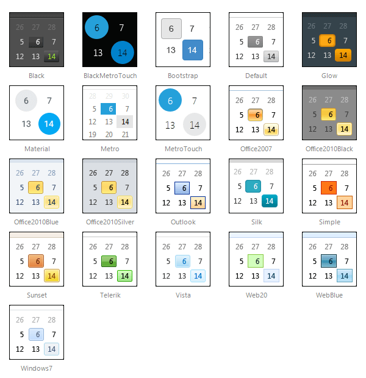

# Skins


The **RadCalendar** controls use **skins** to control their overall look-and-feel. A skin is a set of images and a CSS stylesheet that can be applied to the control elements (date cells, buttons, etc.) and defines their look and feel.To apply a skin to a **RadCalendar**, **RadDatePicker**, **RadTimePicker**, or **RadDateTimePicker** control, set its **Skin** property, either using the properties pane or the control's [Smart Tag]().

The **RadCalendar** controls are installed with a number of preset skins. These are shown below:



## Not using skins

If you do not set the **Skin** property, the **RadCalendar** controls automatically use the "Default" skin. If you do not want to use a skin with your control, set its **Skin** property to an empty string. If you also want to prevent the control's base stylesheet from registering, please set **EnableEmbeddedBaseStylesheet** to **false**. The base styles include alignment, positioning, border widths, paddings, etc.

## Customizing Skins

You can tweak the existing skins, or create your own. Each skin has two main elements: images and a stylesheet. When creating your own skin, it is a good idea to start with the stylesheet of an existing skin and alter that. See [Creating a Custom Skin]() for a step-by-step walk through. To use your own skin:

1. Add the new CSS file to your project.

2. Drag and drop the CSS file from the Project Explorer onto your Web page.

3. Set the **EnableEmbeddedSkins** property of the control to **False**.

4. If the custom skin does not contain background image styles for the calendar or picker buttons, set the **ImagesPath** property to specify the location the navigation images in the **RadCalendar** titlebar and the pickers' popup buttons. **RadCalendar** will look for the following images in the specified location: **arrorRight.gif**, **fastNavRight.gif**, **arrowLeft.gif** and **fastNavLeft.gif**. The date/time pickers will look for the following images: **datePickerPopup.gif**, **datePickerPopupHover.gif**, **clock.gif** and **clockHover.gif**. As an alternative to using **ImagesPath**, you can set the location of each image separately.

**RadCalendar** and pickers' base stylesheet is called **Calendar.css** and is placed in the **...Skins/** directory. The stylesheet for a particular skin has the name **Calendar.[SkinName].css** and can be found in the **...Skins/[SkinName]** directory. The images are found in the **...Skins/[SkinName]/Calendar** directory. For example, the stylesheet for the **"Black"** skin is called **Calendar.Black.css** and is located in the **...Skins/Black** directory. The images are found in the **...Skins/Black/Calendar** directory. The images are referenced by name from within the stylesheet.

The **RadCalendar** stylesheet includes the CSS class definitions that are applied to the **RadCalender** control and all aspects of the **RadDatePicker**, **RadTimePicker** and **RadDateTimePicker** controls except for the embedded **RadDateInput** control. The embedded **RadDateInput** control uses the **RadInput** stylesheet, which has the name **Input.[SkinName].css**.

For more information on the CSS File structure, see [Understanding the Skin CSS File]().

## Setting a custom skin from the web.config

In order to set a custom skin for all **RadDatePickers**, **RadTimePickers** and **RadDateTimePickers** in the website, please use the following keys and values in the web.config:

````XML 
<appSettings>
    <add key="Telerik.DatePicker.Skin" value="MyCustomSkin" />
    <add key="Telerik.TimePicker.Skin" value="MyCustomSkin" />
    <add key="Telerik.DateTimePicker.Skin" value="MyCustomSkin" />
    <add key="Telerik.DatePickingInput.EnableEmbeddedSkins" value="false" />
    <add key="Telerik.DatePickingCalendar.EnableEmbeddedSkins" value="false" />
    <add key="Telerik.RadTimeView.EnableEmbeddedSkins" value="false" />
</appSettings>
````


(Depending on your scenario, you may not need all of the above statements. Note that unlike other controls, the **RadTimeView** control requires a "Rad" prefix.)

In order to set a custom skin for standalone **RadCalendar** controls, please use a **Telerik.Calendar.Skin** and **Telerik.Calendar.EnableEmbeddedSkins** keys.


