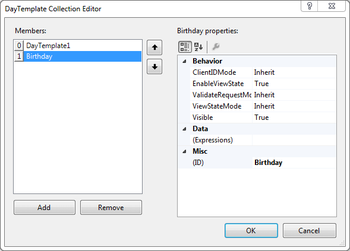

# DayTemplate Collection Editor

## 

The __DayTemplate Collection Editor__ lets you define dynamic template types that can then be applied to [special days]() in the calendar. Once you have defined a dynamic template type, you can use the [template design surface]() to create the template for that type.

To display the __DayTemplate Collection Editor__, click the ellipsis button next to the __CalendarDayTemplates__ property in the properties pane for the __RadCalendar__ control.

To add a dynamic template type to the collection, click the __Add__ button and assign it an __ID__ using the properties grid on the right. You can optionally set the __EnableViewState__ and __Visible__ properties as well, to specify whether the template type uses the view state to store information about the controls in the template and whether the template is visible.

To remove a dynamic template type, select the template type and click the __Remove__ button.

# See Also

 * [RadCalendar Day Templates]()
