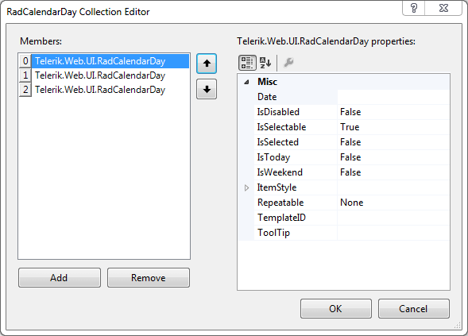

# RadCalendarDay Collection Editor


The **RadCalendarDay Collection Editor** lets you define "special days" that the calendar control treats in a different way than the other days in its display. Special days can correspond to public holidays, vacation days, birthdays, and so on.

To display the **RadCalendarDay Collection Editor**, locate the **SpecialDays** property in the properties pane for the **RadCalendar** control and click the ellipsis button.


Use the **Add** and **Remove** buttons to add or remove special days.

Select a special day and set its properties using the properties grid of the editor. The following table describes the properties of each special day:


| Property | Description |
| ------ | ------ |
| **Date** |The date that is set aside as a "special day". This value is interpreted based on the value of the **Repeatable** property.|
| **IsDisabled** |When **true** , the special day is disabled in the calendar.|
| **IsSelectable** |When **true** , the special day can be selected in the calendar.|
| **IsSelected** |When **true** , the calendar starts up with the special day selected.|
| **IsToday** |When **true** , the calendar defines the special day as "today".|
| **IsWeekend** |When **true** , the special day is formatted as a weekend day.|
| **ItemStyle** |A composite property that lets you assign the style properties of the special day so that it is visually distinct.|
| **Repeatable** |Allows the special day definition to apply to several days in the calendar. Possible values are: **DayInMonth** - Only the day part of the **Date** property is used. The special day repeats every month on the same day; **Today** - The special day settings control the appearance and behavior of today's date. The value of the **Date** property is ignored; **DayAndMonth** - Only the month and day part of the **Date** property are used. The special day repeats every year on the same month and day; **WeekDayWeekNumberAndMonth** - Only the weekday (Mon, Tue, etc.), the week number, and the month are used. The special day repeats every year on a specific weekday in a specific week. Can be used for repeatable holidays that are on a different date each year. For instance Martin Luther King Jr. Day: every third Monday of January. Only the week number, the weekday (Mon, Tue, etc) and the month are used; **WeekAndMonth** - Only the day of the week and the month of the **Date** property are used. The special day repeats once a week on the same day for a specific month; **Week** - Only the day of the week of the **Date** property is used. The special day repeats every week on the same day; **None** - The special day occurs on the date specified by the **Date** property. It does not repeat.|
| **TemplateID** |Identifies a dynamic day template that is used to display the special day. Dynamic day templates are defined using the [DayTemplate Collection Editor]().|
| **ToolTip** |A string that appears as a tooltip when the user hovers the mouse over the special day.|

>note 
If you set the **Repeatable** property for a special day to anything other than "None", you must either enable postbacks ( **AutoPostBack** = **True** ) or set the **EnableRepeatableDaysOnClient** property to **True** .
>


Following is a sample illustrating the use of the **Repeatable** property:

````ASPNET
<telerik:RadCalendar RenderMode="Lightweight" ID="RadCalendar1" runat="server" FocusedDate="1.2008">
    <SpecialDays>
        <telerik:RadCalendarDay Date="2008/01/21" Repeatable="WeekDayWeekNumberAndMonth" IsSelectable="false" >
           <ItemStyle Font-Bold="true"  />
        </telerik:RadCalendarDay>
    </SpecialDays>
</telerik:RadCalendar>
````


# See Also

 * [RadCalendar Day Templates]()
