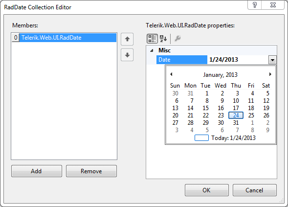

# RadDate Collection Editor

The **RadDate Collection Editor** lets you specify the initially selected values in a calendar that allows multiple dates to be selected.

To display the **RadDate Collection Editor**, click the ellipsis button next to the **SelectedDates** property in the properties pane for the **RadCalendar** control.

To add selected dates, click the **Add** button and set its **Date** property using the properties grid on the right. You can type in a date value, or select one from a popup calendar control that appears when you click the "drop-down" button.

To remove a selected date, select it in the list and click the **Remove** button.

# See Also

 * [Date Selection]()
