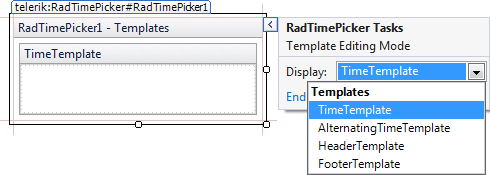

# Template Design Surface

## 

The **Template Design Surface** lets you design templates for portions of the calendar and time view controls.

There are two basic ways to display the Template Design Surface:

From the **RadCalendar**, **RadDateTimePicker**, or **RadTimePicker**[Smart Tag](), choose **Edit Templates.** A Pop-up appears, along with the Template Design Surface. Choose the type of template you want to edit from the Display drop-down:

On the design surface, you can drag any controls from the toolbox, as well as typing any literal text. By moving to Source view, you can add other HTML content to the template and set attributes to display the item's value.

When you have finished designing your template, choose **End Template Editing** from the context menu or Smart Tag pop-up.

# See Also

 * [RadCalendar Day Templates]()

 * [RadCalendar Header and Footer Templates]()

 * [RadTimeView Templates]()
