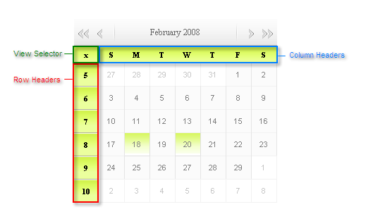

# Column And Row Headers Settings

The column and row headers label the rows and columns of the main calendar area. In between the column and row headers, a view selector can optionally appear as well:

You can control the appearance and behavior of each of these header sections separately.

## Row Headers

The **ShowRowHeaders** property controls whether the row headers appear on the calendar. As shown in the screen shot above, by default, when the row headers appear, they display the week number for each row of the calendar. You can replace the week numbers that appear in the row headers by setting the **RowHeaderText** and/or the **RowHeaderImage** property. When you assign a value to the **RowHeaderText** property, every row in the calendar gets the same text label. When you assign a value to the **RowHeaderImage** property, every row in the calendar is labeled by the image you specify. If you assign both properties, the image appears to the left of the text label.

If the calendar supports multi-day selection, you can use the row headers as selectors by setting the **UseRowHeadersAsSelectors** property. See [Date Selection]() for details.

## Column Headers

The **ShowColumnHeaders** property controls whether the column headers appear on the calendar. As shown in the screen shot above, by default, when the row headers appear, they display the first letter of the day of the week. You can change the labels for the day of the week using the **DayNameFormat** property. The possible values are:

* **Full** - The column headers use the entire name of each week day to label the days of the week.

* **Short** - The column headers use 3-letter abbreviations to label each day of the week.

* **FirstLetter** - The column headers use the first initial to label each day of the week.

* **FirstTwoLetters** - The column headers use the first two letters of the day name to label each day of the week.

* **Shortest** - The column headers use the shortest string that distinguishes the week days to label each day of the week.

You can replace the week day labels altogether by setting the **ColumnHeaderText** and/or the **ColumnHeaderImage** property. When you assign a value to the **ColumnHeaderText** property, every column in the calendar gets the same text label. When you assign a value to the **ColumnHeaderImage** property, every column in the calendar is labeled by the image you specify. If you assign both properties, the image appears to the left of the text label.

If the calendar supports multi-day selection, you can use the row headers as selectors by setting the **UseColumnHeadersAsSelectors** property. See [Date Selection]() for details.

## View Selector

The **EnableViewSelector** property controls whether a view selector appears in the upper left corner. As shown in the screen shot above, by default, the view selector appears as a small "X". You can replace this default appearance by setting the **ViewSelectorText** and/or **ViewSelectorImage** property. When you assign a value to the **ViewSelectorText** property, the "X" is replaced by the text you specify. When you assign a value to the **ViewSelectorImage** property, the "X" is replaced by the image you specify. If you assign both properties, the image appears to the left of the text label. The style applied to the view selector table cell can be altered with the **ViewSelectorStyle** property.

If the calendar supports multi-day selection, the view selector automatically acts to change the selection of every day visible in the calendar. See [Date Selection]() for details.

# See Also

 * [OnColumnHeaderClick]()

 * [OnRowHeaderClick]()

 * [OnViewSelectorClick]()
