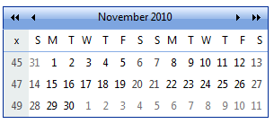
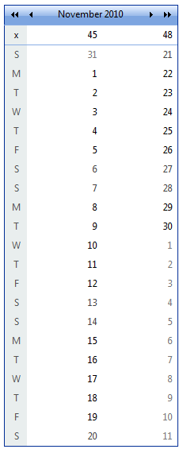

# Customizing the Day Matrix

By default, **RadCalendar** lays out its day matrix like an ordinary calendar, with 7 columns (one for each day of the week) and 6 rows (the maximum number of weeks needed in a month). You can change this default layout using two properties: **Orientation** and **MonthLayout**.

## Horizontal orientation

When **Orientation** is **RenderInRows** (the default), the days are laid out horizontally, in rows. Three values of the **MonthLayout** property are designed for showing a single month using this horizontal orientation:

* When **MonthLayout** = **Layout_7columns_x_6rows** and **Orientation** = **RenderInRows**, each row represents a single week:

* When **MonthLayout** = **Layout_14columns_x_3rows** and **Orientation** = **RenderInRows**, each row represents two weeks:

* When **MonthLayout** = **Layout_21columns_x_2rows** and **Orientation** = **RenderInRows**, each row represents three weeks:

## Vertical orientation

When **Orientation** is **RenderInColumns**, the days are laid out vertically, in columns. Three values of the **MonthLayout** property are designed for showing a single month using this vertical orientation:

* When **MonthLayout** = **Layout_7rows_x_6columns** and **Orientation** = **RenderInColumns**, each column represents a single week:

* When **MonthLayout** = **Layout_14rows_x_3columns** and **Orientation** = **RenderInColumns**, each column represents two weeks:

* When **MonthLayout** = **Layout_21rows_x_2columns** and **Orientation** = **RenderInColumns**, each column represents three weeks:

## Changing the dimensions of the day matrix directly

The dimensions of the day matrix are not limited to the 6 possible values of the **MonthLayout** property. You can set the number of rows and columns separately using the **SingleViewRows** and **SingleViewColumns** properties. For example, the following screen shot shows an entire year in a single matrix on a **RadCalendar** with **SingleViewRows** = 7 and **SingleViewColumns** = 53:

>note 
When using the **SingleViewRows** and **SingleViewColumns** properties, the day matrix typically does not focus on a single month. To control the first week that appears in the resulting calendar, set the **FocusedDate** property to a day in the first month you want to appear at the beginning of the calendar.
>

# See Also

 * [Multi-View Mode]()

 * [Managing Dates]()

 * [Column And Row Headers Settings]()

 * [DayRender]()
