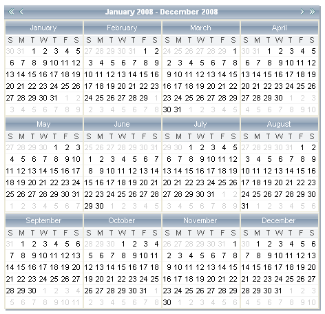

# Multi-View Mode


**RadCalendar** can be easily configured to show more than one month in the calendar area. To enable this functionality, simply set the **MultiViewRows** and **MultiViewColumns** properties to specify the number of month views to appear in each row and column.

>note 
When using Multi-view mode, it is a good idea to use the **CalendarTableStyle** property to provide some separation between the individual calendar views. For more information on style properties, see [Styles]().
>



The code below shows the configuration of the multi-view calendar shown above:

````ASPNET
 <telerik:RadCalendar
    ID="RadCalendar1"
    runat="server"
    ShowRowHeaders="False"
    Skin="WebBlue"
    DayNameFormat="FirstLetter"
    EnableMultiSelect="False"
    FocusedDate="2008-01-01"
    AutoPostBack="True"
    MultiViewColumns="4"
    MultiViewRows="3" >
    <CalendarTableStyle BorderStyle="Solid" BorderWidth="1px" />
</telerik:RadCalendar>
````


>caution 
Multi-view calendar logic works -only- when **AutoPostBack="true"** . As a result, if a **RadCalendar** control is used as the popup control inside a **RadDatePicker** or **RadDateTimePicker** control, it cannot use multi-view mode.
>


# See Also

 * [Customizing the Day Matrix]()
