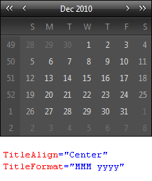
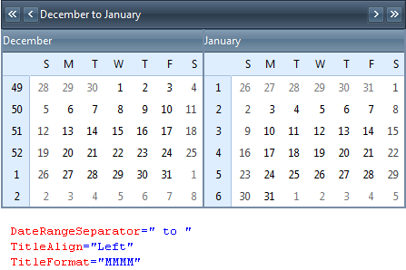

# Title Settings


You can customize the **RadCalendar** Title to define how and what information should be shown.

## Title text

The text on the title depends on whether the calendar is in single or [multi view mode]().

* In single view mode, the text of the title is the formatted value of the month shown in the [day matrix](). More precisely, it is the formatted value of a **DateTime** object for the first day of the current month at 12:00 AM.

* In multi view mode, the text of the title is the formatted value of the first month view that is showing, followed by a date range separator, followed by the formatted value of the last month view that is showing. More precisely, it is the formatted value of a **DateTime** object for the first day of the first month at 12:00 AM, followed by a date range separator, followed by the formatted value of a **DateTime** object for the last day of the last month at 12:00 AM.

You can control the formatting of the dates in the title using the **TitleFormat** and **DateRangeSeparator** properties:

* The **TitleFormat** property is a standard [Date format pattern](), that controls how the **DateTime** objects that represent the date or dates in the title are formatted.

* The **DateRangeSeparator** property is the string that is used as a date range separator in multi view mode.

You can control the placement of the title text in the title bar by setting the **TitleAlign** property. **TitleAlign** can be set to any of the values applicable to an HTML *align* attribute, or it can be set to **NotSet**, which leaves the align attribute of the rendered HTML for the title element.

>note 
When the calendar is in multi view mode, the **TitleAlign** property controls the alignment of the titles for each individual view as well as the alignment of the title in the title bar.
>


The following screenshots show the effects of the **TitleFormat**, **DateRangeSeparator** and **TitleAlign** properties:




## Title Customization

Title customization for **RadCalendar** is achieved on per **CalendarView** basis. And since no **CalendarView** objects are exposed for design time editing, title customization can be accomplished only programmatically. The customization should be done at any point before the **Render** event of the page.

In order to set the title for the top calendar view, you should assign your value to **Title** property of the **CalendarView** object exposed by **RadCalendar**. If you have a multi month view for your calendar, you can set the title for each child view looping through all of the child views at any point before the **Render** event and set their titles accordingly:


````C#
protected void Page_Load(object sender, EventArgs e)
{
    RadCalendar1.CalendarView.Title = "Title for the top view";
    foreach (CalendarView view in RadCalendar1.CalendarView.ChildViews)
    {
        view.Title = "Month of " + view.GetEffectiveVisibleDate().ToString("MMMM");
    }
}
````
````VB.NET
Protected Sub Page_Load(sender As Object, e As EventArgs) Handles Me.Load
    RadCalendar1.CalendarView.Title = "Title for the top view"
    For Each view As CalendarView In RadCalendar1.CalendarView.ChildViews
        view.Title = "Month of " + view.GetEffectiveVisibleDate().ToString("MMMM")
    Next
End Sub
````


An alternative approach is to use the new **ChildViewRender** event exposed by **RadCalendar** which is fired for each child view just before it is rendered in the page response output. As such, this event constitutes the perfect place for setting the title of each child view:


````C#
protected void RadCalendar1_ChildViewRender(object sender, ChildViewRenderEventArgs e)
{
    e.CalendarView.Title = "Month of " + e.CalendarView.GetEffectiveVisibleDate().ToString("MMMM");
}
````
````VB.NET
Protected Sub RadCalendar1_ChildViewRender(sender As Object, e As ChildViewRenderEventArgs) Handles RadCalendar1.ChildViewRender
    e.CalendarView.Title = "Month of " + e.CalendarView.GetEffectiveVisibleDate().ToString("MMMM")
End Sub
````


As noticed from the example code snippets above, each calendar view object exposes a method to get the first effective visible data in the month that the calendar view displays. In addition, the old property **TitleContent** attached to each calendar view keeps the default title for the view. Together, both properties provide useful information to enable convenient way for title customization in any given application scenario.

## Title bar appearance

In addition to the title text, the title bar contains a set of navigation controls for changing the current view. For information on how to remove the navigation buttons or customize their appearance, see [Customizing the Navigation Controls]().

The **TitleStyle** property affects the overall appearance of the title bar area. For details on using style properties, see [Styles]().

# See Also

 * [RadCalendar Structure]()
