# Getting Started Overview

This tutorial will walk you through creating a Web page that uses **RadCalendar** controls. It shows how to:

* Use the four different RadCalendar controls (**RadCalendar**, **RadDatePicker**, **RadDateTimePicker**, and **RadTimePicker**).

* Apply skins to change the overall look and feel of the controls.

* Apply styles to tweak the appearance of the controls.

* Configure the selection and navigation behavior of the **RadCalendar** control.

* Add messages to appear when nothing is entered in **RadDatePicker**, **RadDateTimePicker** and **RadTimePicker**.

* Specify formats for display and editing.

## Adding a RadCalendar control

1. Drag a **RadCalendar** control from the toolbox onto your Web Page. Its [Smart Tag]() should appear automatically:
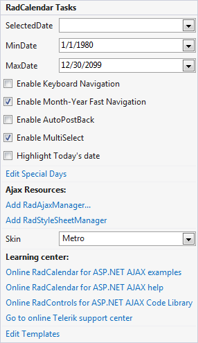

2. In the **RadCalendar** [Smart Tag](), choose "Outlook" from the **Skin** drop-down:
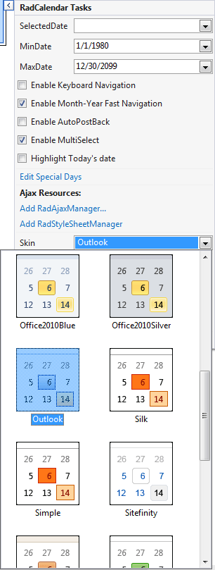

3. In the designer, right-click the **RadCalendar** control and select **Properties** from its context menu:
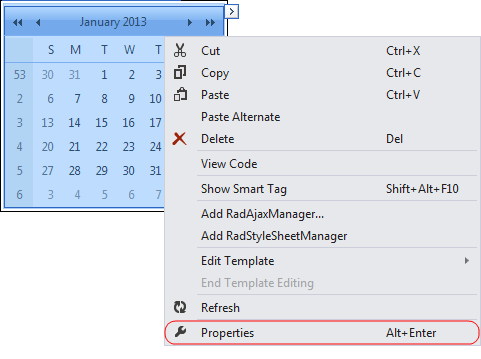

4. In the properties pane for the **RadCalendar** control, the **Appearance** section contains a number of properties with names that end in "Style". These [Style properties]() let you tweak the appearance of different parts of the **RadCalendar** control, further customizing it beyond the effects of the chosen skin. Expand the section for **Calendar TableStyle**. This is the default style for the main grid of the calendar. Change the **BackColor** property to **#DDEEFF**. This gives the calendar grid a light blue background:
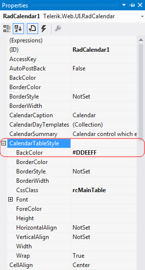

5. In the **Dates Management** section of the properties pane, click the ellipsis button next to the **SelectedDates** property:
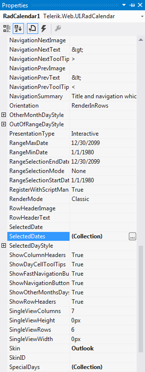

6. The [RadDate Collection Editor]() appears, where you can specify a set of dates as the initial selection for the **RadCalendar** control. In the **RadDate Collection Editor**, click the **Add** button to add a date. In the properties pane on the right, click the drop-down next to the **Date** property, and select a date from the pop-up calendar control. Click the **Add** button again to add another date,and assign another value to its **Date** property. When you have added as many dates as you want, click OK to accept the collection of selected dates:
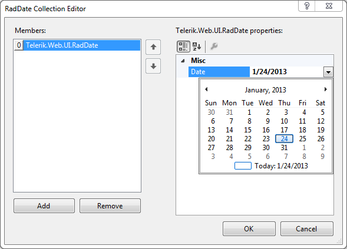

7. Set the **EnableNavigationAnimation** property to **True**. This causes the **RadCalendar** control to display animated effects when the user changes the current month using the navigation controls in the title bar:
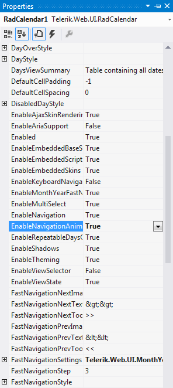

8. Set the **EnableViewSelector** property to **True**. This adds a control to the upper left corner of the grid portion of the calendar control for selecting all visible days in the grid.
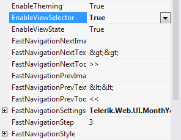

9. Set the **ShowOtherMonthDays** property to **False**. This configures **RadCalendar** so that it only displays dates for the current month.
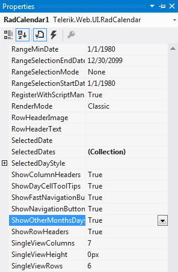

## Adding a RadDatePicker control

1. Drag a **RadDatePicker** control from the toolbox onto your Web Page, below the **RadCalendar** control.

2. In the **RadDatePicker** [Smart Tag]() that appears automatically, choose "Outlook" from the drop-down list for the **Skin** property:
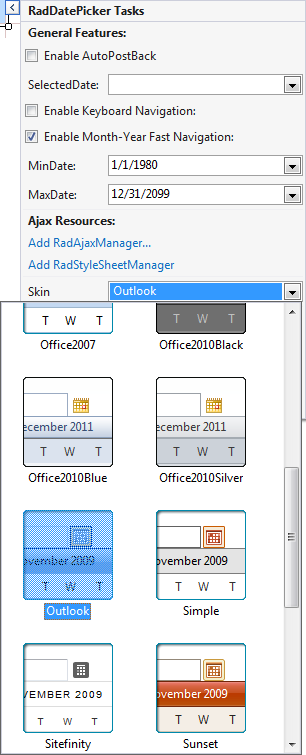

3. In the properties pane for the **RadDatePicker** control, locate the **Calendar** property. This lets you configure the embedded **RadCalendar** control that acts as a popup. Locate its **CalendarTableStyle** property and set the**BackColor** to **#DDEEFF** to match the **RadCalendar** control you added earlier.
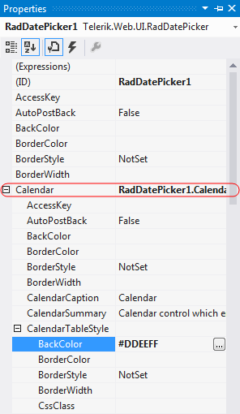

4. Also under the **Calendar** property, set the **ShowOtherMonthDays** property to **False**, so that the appearance matches the other **RadCalendar** control on the page.

5. Locate the **DateInput** property. This lets you configure the embedded **RadDateInput** control. Change the following properties for the embedded **RadDateInput** control:

    * Set the value of the **DisplayDateFormat** property to "dddd, MMM d, yyyy".This tells the **RadDateInput** control how to format its value when it does not have input focus(when the user is not editing its value.)

    * Set the **EmptyMessage** property to " Enter a Date ". This tells the**RadDateInput** control to display the specified prompt when its value has not been set.
    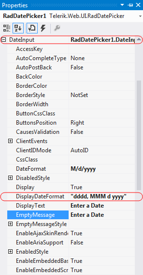

6. Set the **MinDate** and **MaxDate** properties to specify the range of valid dates that the user can enter into the **RadDatePicker** control**.
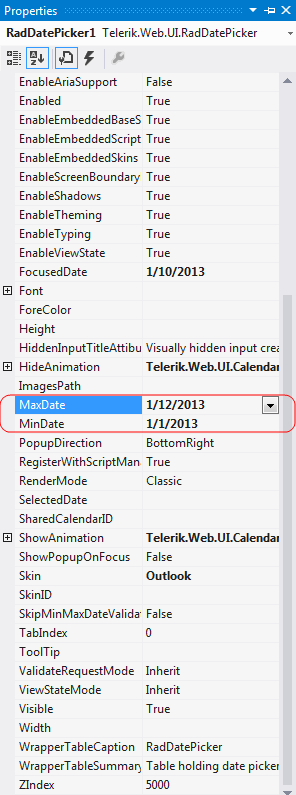

## Adding a RadDateTimePicker control

1. Drag a **RadDateTimePicker** control from the toolbox onto your Web Page, below the **RadDatePicker** control.

2. In the properties pane for the **RadDateTimePicker**, set the **Skin** property to "Outlook":

3. In the **Behavior** section of the properties pane, locate the **Calendar** property. As you did with the **RadDatePicker** control, set the **Calendar.CalendarTableStyle.BackColor** property to "#DDEEFF" and the **Calendar. ShowOtherMonthDays** property to **False**.

4. Locate the **DateInput** property. This lets you configure the embedded **RadDateInput** control. Change the following properties for the embedded **RadDateInput** control:

    * Set the value of the **DateFormat** property to "M/d/yyyy h:mm tt". This tells the **RadDateInput** control how to format its value when it has input control (when the user can edit its value).

    * Set the value of the **DisplayDateFormat** property to "MMM d, yyyy h:mm tt". This tells the **RadDateInput** control how to format its value when it does not have input focus (when the user is not editing its value.)

    * Set the **EmptyMessage** property to " Enter a date and time ". This tells the **RadDateInput** control to display the specified prompt when its value has not been set.
    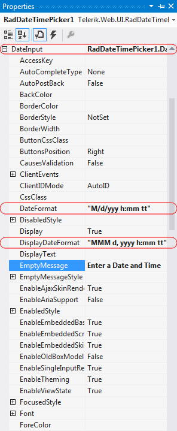

5. Expand the **TimeView** property. This lets you configure the properties of the embedded **RadTimeView** control that acts as a popup for choosing time values. Set its **BackColor** property to "#DDEEFF". This gives it the time selection popup the same background color that we gave the popup **RadCalendar** control.
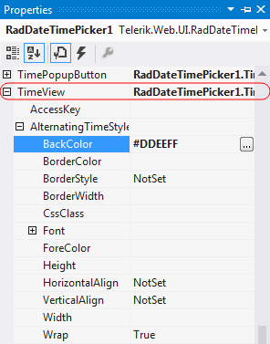

## Adding a RadTimePicker control

1. Drag a **RadTimePicker** control from the toolbox onto your Web page,below the **RadDateTimePicker** control.

2. In the **RadTimePicker** properties pane, set the **Skin** property to "Outlook" so that it matches the **RadCalendar** and **RadDatePicker** controls:
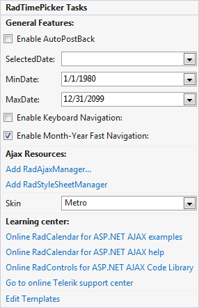

3. In the **Behavior** section of the properties pane, expand the **DateInput** property and configure the embedded **RadDateInput** control:

    * Set the **DateFormat** property to "h:mm tt". This is the format string for when embedded **RadDateInput** control has focus (when the user can enter its value).

    * Set the **DisplayDateFormat** property to "HH:mm". This causes the embedded **RadDateInput** control to format its value using a 24-hour clock when it does not have focus.

    * Set the **EmptyMessage** property to " Enter a Time ", providing a prompt when the value of the **RadTimePicker** control has not been set.
    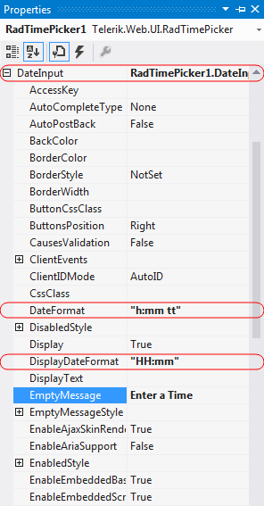

4. Expand the **TimeView** property. This lets you configure the properties of the embedded **RadTimeView** control that acts as a popup for choosing time values. Set its **BackColor** property to "#DDEEFF", just like you did for the **RadDateTimePicker** control.

## Running the application

1. Run the application. When it first starts up, the **RadCalendar** control shows multiple selected dates, reflecting the value you set for the **SelectedDates** property. The **RadDatePicker**, **RadDateTimePicker** and **RadTimePicker** controls all show their empty messages, because no value has been assigned yet. All four controls reflect the "Outlook" skin. On top of that, the **RadCalendar** control uses the background color you set using the **CalendarTableStyle** property, and it does not display any days for the non-current month:

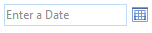
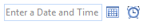
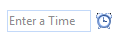

2. Click the view selector control in the upper left corner of the **RadCalendar** control.The entire month becomes selected:

3. Click the navigation controls in the title bar of the **RadCalendar** control,and note the animated effect as the month changes:
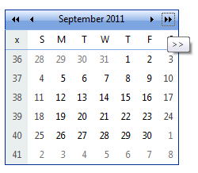

4. Scroll the popup calendar on the **RadDatePicker** control using the navigation controls in its title bar. Note that you cannot navigate before the minimum date you have specified or after the maximum date.

5. Select a date and time value for each of the controls. Note the formatting changes depending on whether the controls have focus.

# See Also

 * [RadCalendar Structure]()

 * [RadDatePicker, RadTimePicker, and RadDateTimePicker Structure]()
