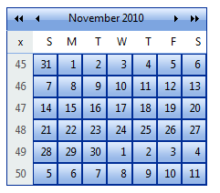

# Getting Started Overview

This tutorial will walk you through creating a Web page that uses __RadCalendar__ controls. It shows how to:

* Use the four different RadCalendar controls (__RadCalendar__, __RadDatePicker__, __RadDateTimePicker__, and __RadTimePicker__).

* Apply skins to change the overall look and feel of the controls.

* Apply styles to tweak the appearance of the controls.

* Configure the selection and navigation behavior of the __RadCalendar__ control.

* Add messages to appear when nothing is entered in __RadDatePicker__, __RadDateTimePicker__, and __RadTimePicker__.

* Specify formats for display and editing.

## Adding a RadCalendar control

1. Drag a __RadCalendar__ control from the toolbox onto your Web page.Its [Smart Tag]() should appearautomatically:

1. In the __RadCalendar__[Smart Tag](), choose "Outlook" from the__Skin__ drop-down:

1. In the designer, right-click the __RadCalendar__ control and choose__Properties__ from its context menu:

1. In the properties pane for the __RadCalendar__ control, the __Appearance__ section contains a number of properties with names that end in "Style". These [Style properties]() let you tweak the appearance of different parts of the __RadCalendar__ control, further customizing it beyond the effects of the chosen skin. Expand the section for __Calendar TableStyle__. This is the default style for the main grid of the calendar. Change the __BackColor__ property to "#DDEEFF". This gives the calendar grid a light blue background:

1. In the __Dates Management__ section of the properties pane, click the ellipsis button next to the__SelectedDates__ property:

1. The [RadDate Collection Editor]() appears, where you canspecify a set of dates as the initial selection for the __RadCalendar__ control. In the __RadDate Collection Editor__, click the __Add__ button to add a date.In the properties pane on the right, click the drop-down next to the __Date__ property, andselect a date from the pop-up calendar control. Click the __Add__ button again to add another date,and assign another value to its __Date__ property. When you have added as many dates as you want,click OK to accept the collection of selected dates:

1. Set the __EnableNavigationAnimation__ property to __True__.This causes the __RadCalendar__ control to display animated effects when the user changes thecurrent month using the navigation controls in the title bar:

1. Set the __EnableViewSelector__ property to __True__.This adds a control to the upper left corner of the grid portion of the calendar control for selecting all of thevisible days in the grid.

1. Set the __ShowOtherMonthDays__ property to __False__. This configures the__RadCalendar__ so that it only displays dates for the current month.

## Adding a RadDatePicker control

1. Drag a __RadDatePicker__ control from the toolbox onto your Web page, below the __RadCalendar__ control.

1. In the __RadDatePicker__[Smart Tag]() that appears automatically, choose "Outlook"from the drop-down list for the __Skin__ property:

1. In the properties pane for the __RadDatePicker__ control, locate the__Calendar__ property. This lets you configure the embedded __RadCalendar__control that acts as a popup. Locate its __CalendarTableStyle__ property and set the__BackColor__ to "#DDEEFF" to match the __RadCalendar__ control you added earlier.

1. Also under the __Calendar__ property, set the __ShowOtherMonthDays__property to __False__, so that the appearance matches the other __RadCalendar__control on the page.

1. Locate the __DateInput__ property. This lets you configure the embedded __RadDateInput__ control. Change the following properties for the embedded __RadDateInput__ control:

* Set the value of the __DisplayDateFormat__ property to "dddd, MMM d, yyyy".This tells the __RadDateInput__ control how to format its value when it does not have input focus(when the user is not editing its value.)

* Set the __EmptyMessage__ property to " Enter a Date ". This tells the__RadDateInput__ control to display the specified prompt when its value has not been set.

1. Set the __MinDate__ and __MaxDate__ properties to specify the range ofvalid dates that the user can enter into the __RadDatePicker__ control__.__

## Adding a RadDateTimePicker control

1. Drag a __RadDateTimePicker__ control from the toolbox onto your Web page, below the__RadDatePicker__ control.

1. In the properties pane for the __RadDateTimePicker__, set the __Skin__ property to "Outlook":

1. In the __Behavior__ section of the properties pane, locate the__Calendar__ property. As you did with the __RadDatePicker__ control,set the __Calendar.CalendarTableStyle.BackColor__ property to "#DDEEFF" and the __Calendar. ShowOtherMonthDays__ property to __False__.

1. Locate the __DateInput__ property. This lets you configure the embedded __RadDateInput__ control. Change the following properties for the embedded __RadDateInput__ control:

* Set the value of the __DateFormat__ property to "M/d/yyyy h:mm tt".This tells the __RadDateInput__ control how to format its value when it has input control(when the user can edit its value).

* Set the value of the __DisplayDateFormat__ property to "MMM d, yyyy h:mm tt".This tells the __RadDateInput__ control how to format its value when it does not have input focus(when the user is not editing its value.)

* Set the __EmptyMessage__ property to " Enter a date and time ".This tells the __RadDateInput__ control to display the specified prompt when its value has not been set.

1. Expand the __TimeView__ property. This lets you configure the properties of the embedded__RadTimeView__ control that acts as a popup for choosing time values. Set its__BackColor__ property to "#DDEEFF". This gives it the time selection popup the same backgroundcolor that we gave the popup __RadCalendar__ control.

## Adding a RadTimePicker control

1. Drag a __RadTimePicker__ control from the toolbox onto your Web page,below the __RadDateTimePicker__ control.

1. In the __RadTimePicker__ properties pane, set the __Skin__ propertyto "Outlook" so that it matches the __RadCalendar__ and __RadDatePicker__controls:

1. In the __Behavior__ section of the properties pane, expand the __DateInput__ property and configure the embedded __RadDateInput__ control:

* Set the __DateFormat__ property to "h:mm tt". This is the format string forwhen embedded __RadDateInput__ control has focus (when the user can enter its value).

* Set the __DisplayDateFormat__ property to "HH:mm". This causes the embedded__RadDateInput__ control to format its value using a 24-hour clock when it does not have focus.

* Set the __EmptyMessage__ property to " Enter a Time ", providing a promptwhen the value of the __RadTimePicker__ control has not been set.

1. Expand the __TimeView__ property. This lets you configure the properties of the embedded__RadTimeView__ control that acts as a popup for choosing time values. Set its__BackColor__ property to "#DDEEFF", just like you did for the__RadDateTimePicker__ control.

## Running the application

1. Run the application. When it first starts up, the __RadCalendar__ control shows multiple selected dates, reflecting the value you set for the __SelectedDates__ property. The __RadDatePicker__, __RadDateTimePicker__, and __RadTimePicker__ controls all show their empty messages, because no value has been assigned yet. All four controls reflect the "Outlook" skin. On top of that, the __RadCalendar__ control uses the background color you set using the __CalendarTableStyle__ property, and it does not display any days for the non-current month:

1. Click the view selector control in the upper left corner of the __RadCalendar__ control.The entire month becomes selected:

1. Click the navigation controls in the title bar of the __RadCalendar__ control,and note the animated effect as the month changes:

1. Scroll the popup calendar on the __RadDatePicker__ control using the navigation controls in its title bar. Note that you cannot navigate before the minimum date you have specified or after the maximum date.

1. Select a date and time value for each of the controls. Note the formatting changes depending on whether the controls have focus.

# See Also

 * [RadCalendar Structure]()

 * [RadDatePicker, RadTimePicker, and RadDateTimePicker Structure]()
