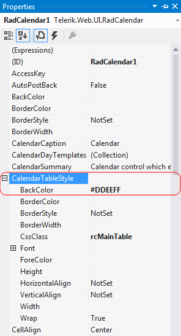

# Getting Started Overview

This tutorial will walk you through creating a Web page that uses **RadCalendar** controls. It shows how to:

* Use the  RadCalendar control.

* Apply skins to change the overall look and feel of the controls.

* Apply styles to tweak the appearance of the controls.

* Configure the selection and navigation behavior of the **RadCalendar** control.

* Add messages to appear when nothing is entered in **RadDatePicker**, **RadDateTimePicker** and **RadTimePicker**.

* Specify formats for display and editing.

## Adding a RadCalendar control

1. Drag a **RadCalendar** control from the toolbox onto your Web Page. Its [Smart Tag]() should appear automatically:

2. In the **RadCalendar** [Smart Tag](), choose "Outlook" from the **Skin** drop-down:

3. In the designer, right-click the **RadCalendar** control and select **Properties** from its context menu:

4. In the properties pane for the **RadCalendar** control, the **Appearance** section contains a number of properties with names that end in "Style". These [Style properties]() let you tweak the appearance of different parts of the **RadCalendar** control, further customizing it beyond the effects of the chosen skin. Expand the section for **Calendar TableStyle**. This is the default style for the main grid of the calendar. Change the **BackColor** property to **#DDEEFF**. This gives the calendar grid a light blue background:

5. In the **Dates Management** section of the properties pane, click the ellipsis button next to the **SelectedDates** property:

6. The [RadDate Collection Editor]() appears, where you can specify a set of dates as the initial selection for the **RadCalendar** control. In the **RadDate Collection Editor**, click the **Add** button to add a date. In the properties pane on the right, click the drop-down next to the **Date** property, and select a date from the pop-up calendar control. Click the **Add** button again to add another date,and assign another value to its **Date** property. When you have added as many dates as you want, click OK to accept the collection of selected dates:

7. Set the **EnableNavigationAnimation** property to **True**. This causes the **RadCalendar** control to display animated effects when the user changes the current month using the navigation controls in the title bar:

8. Set the **EnableViewSelector** property to **True**. This adds a control to the upper left corner of the grid portion of the calendar control for selecting all visible days in the grid.

9. Set the **ShowOtherMonthDays** property to **False**. This configures **RadCalendar** so that it only displays dates for the current month.

## Running the application

1. Run the application. When it first starts up, the **RadCalendar** control shows multiple selected dates, reflecting the value you set for the **SelectedDates** property. The **RadDatePicker**, **RadDateTimePicker** and **RadTimePicker** controls all show their empty messages, because no value has been assigned yet. All four controls reflect the "Outlook" skin. On top of that, the **RadCalendar** control uses the background color you set using the **CalendarTableStyle** property, and it does not display any days for the non-current month:

2. Click the view selector control in the upper left corner of the **RadCalendar** control.The entire month becomes selected:

3. Click the navigation controls in the title bar of the **RadCalendar** control,and note the animated effect as the month changes:

4. Scroll the popup calendar on the **RadDatePicker** control using the navigation controls in its title bar. Note that you cannot navigate before the minimum date you have specified or after the maximum date.

5. Select a date and time value for each of the controls. Note the formatting changes depending on whether the controls have focus.

# See Also

 * [RadCalendar Structure]()

