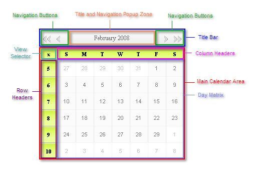
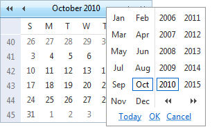
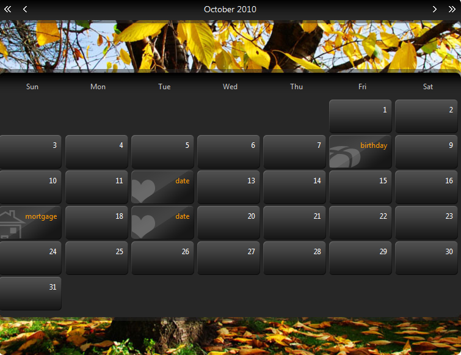

# RadCalendar Structure

## 

The diagram below shows the element structure of **RadCalendar**. The control elements are described below.

* **Title Bar** - displays the selected date range (month and year) as well as the navigation buttons. The appearance of both the [title]() and [navigation buttons]() can be customized.

* **Navigation Buttons** - allow you to move to the previous or next month or jump multiple steps forward or backward.

* **Title and Navigation Popup Zone** - the title area can be set as a navigation popup zone,so that when the user clicks it, it displays the month/year navigation popup:

* **Main Calendar Area** - renders the calendar views, whether single or[multiple](). Each calendar view in the maincalendar area includes a view selector, row and column headers, and the day matrix.

* **View Selector** - allows the user to select all the dates displayed in the day matrix.This control can optionally be omitted, using the **EnableViewSelector** property.

* **Row Headers** - label the rows of the calendar. Depending on the calendar orientation,they either display the week of the year, or the day of the week. The **ShowRowHeaders**property controls whether they appear in the calendar, and the **UseRowHeadersAsSelectors**property specifies whether they can be used to toggle the selection on a row of dates.

* **Column Headers** - label the columns of the calendar. Depending on the calendar orientation,they either display the day of the week, or the week of the year. The **ShowColumnHeaders**property controls whether they appear in the calendar, and the **UseColumnHeadersAsSelectors**property specifies whether they can be used to toggle the selection on a row of dates.

* **Day Matrix** - displays the dates of the month in a particular calendar view. The **ShowOtherMonthDays** property controls whether the day matrix includes the last days of the previous month and the first days of the next month when they fall on the same week as the first or last day of the month. You can [customize the layout of the day matrix]().

If you use [templates](), the calendar can also include header and footer regions:

* **Header** - falls between the Title Bar and the Main Calendar Аrea. It is used mainly for visual customization.

* **Footer** - falls below the Main Calendar Area. It can be used for visual customization or for displaying additional information about the selected item.

# See Also

 * [RadDatePicker, RadTimePicker, and RadDateTimePicker Structure]()

 * [RadTimeView Structure]()
