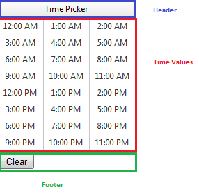

# RadTimeView Structure

The **RadTimeView** control works only as a popup embedded in a **RadTimePicker** or **RadDateTimePicker** control. The main reason to add a **RadTimeView** control from the toolbox to the Web page is when using it as a [shared popup control]().

The following diagram shows the structure of the **RadTimeView** control:

* **Header** - displays the title of the time view control. You can hide the header using the **ShowHeader** property, or alter its content and appearance using a header [template]().

* **Time Values** - allow the user to select a time value by clicking with the mouse. You can configure the [layout of the time values](), as well as apply different [styles]() for alternating time values.

* **Footer** - by default has no content, and does not appear, even if the **ShowFooter** property is true. You can provide content to the footer using a [template]().

# See Also

 * [RadCalendar Structure]()

 * [RadDatePicker, RadTimePicker, and RadDateTimePicker Structure]()
