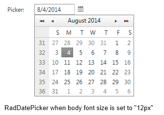
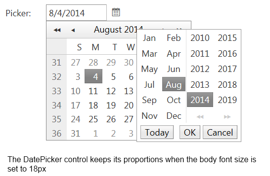

# Fluid and Elastic Capabilities


The RadCalendar including the picker controls provide elastic and fluid capabilities which allow keeping the control’s component proportion on different mobile devices.

## Fluid capability

The **fluid** capabilities are simply achievable by setting the control’s width in **percentages**.

## Elastic capability

To take advantage **elastic** functionality advantage you could set a specific **font size** based on the application target **mobile device** and follow three simple steps to transform the **RadCalendar/Picker** controls to be **elastic**:

1. By using specific CSS selectors apply "**1em**" font size for all the **Calendar** components like this:

````ASPNET
<style type="text/css">
    /*Calednar*/ html .RadCalendar,
    /*MonthYearPicker, RadDatePicker FastNavigation Popup*/ html .RadCalendarMonthView,
    /*TimeView Popup*/ html .RadCalendarTimeView,
    /*Input, DateInput*/ html .RadInput, html .riTextBox,
    html .RadPicker {
        font-size: 1em;
    }
</style>
````


2. Set the **RenderMode** property of the **Calendar**, **DatePicker**, **DateTimePicker**, **MonthYearPicker** controls to "**Lightweight**"

````ASPNET
<telerik:raddatepicker id="RadDatePicker2" runat="server" selecteddate="8.4.2014"
    rendermode="Lightweight" width="13.3333em" dateinput-label="Label:"></telerik:raddatepicker>
<telerik:raddatepicker id="RadDatePicker3" runat="server" selecteddate="8.4.2014"
    rendermode="Lightweight" width="13.3333em" dateinput-label="Label:"></telerik:raddatepicker>
<telerik:radtimepicker id="RadTimePicker2" runat="server" selectedtime="10:00" rendermode="Lightweight"
    width="13.3333em" dateinput-label="Label:"></telerik:radtimepicker>
<telerik:raddatetimepicker id="RadDateTimePicker2" runat="server" selecteddate="4.8.2014 10:00"
    rendermode="Lightweight" dateinput-label="Label:" width="13.3333em"></telerik:raddatetimepicker>
<telerik:radmonthyearpicker id="RadMonthYearPicker2" runat="server" selecteddate="8.2014"
    rendermode="Lightweight" width="13.3333em" dateinput-label="Label:"></telerik:radmonthyearpicker>
<telerik:radcalendar id="RadCalendar1" runat="server" rendermode="Lightweight" autopostback="true">
			<SpecialDays>
				<telerik:RadCalendarDay Repeatable="Today" ItemStyle-CssClass="rcToday"></telerik:RadCalendarDay>
				<telerik:RadCalendarDay Repeatable="DayInMonth" Date="6/19/2014" ItemStyle-CssClass="rcSelected"></telerik:RadCalendarDay>
				<telerik:RadCalendarDay Repeatable="DayInMonth" Date="6/17/2014" ItemStyle-CssClass="rcHover"></telerik:RadCalendarDay>
			</SpecialDays>
		</telerik:radcalendar>
<telerik:radcalendar id="RadCalendar2" runat="server" rendermode="Lightweight" autopostback="true"
    multiviewcolumns="2" multiviewrows="2"></telerik:radcalendar>
````


3. Set the picker components **width** in "**em**". In order to keep the default calendar/pickers **proportion** on mobile devices we would suggest you to set **width="13.3333em"** as the default width of the components is "**160px**" and the font-size is originally set to "**12px**"See the both images bellow that presents the control's **elastic** capability

	* DatePicker control's rendering in case the body font size is set to 12px
	

	* DatePicker control's rendering in case the body font size is set to 18px
	
