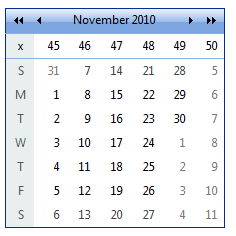
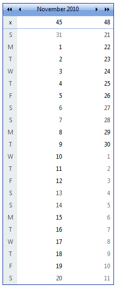

# Customizing the Day Matrix

By default, __RadCalendar__ lays out its day matrix like an ordinary calendar, with 7 columns (one for each day of the week) and 6 rows (the maximum number of weeks needed in a month). You can change this default layout using two properties: __Orientation__ and __MonthLayout__.

## Horizontal orientation

When __Orientation__ is "RenderInRows" (the default), the days are laid out horizontally, in rows. Three values of the __MonthLayout__ property are designed for showing a single month using this horizontal orientation:

* When __MonthLayout__ = "Layout_7columns_x_6rows" and __Orientation__ = "RenderInRows", each row represents a single week:

* When __MonthLayout__ = "Layout_14columns_x_3rows" and __Orientation__ = "RenderInRows", each row represents two weeks:

* When __MonthLayout__ = "Layout_21columns_x_2rows" and __Orientation__ = "RenderInRows", each row represents three weeks:

## Vertical orientation

When __Orientation__ is "RenderInColumns", the days are laid out vertically, in columns. Three values of the __MonthLayout__ property are designed for showing a single month using this vertical orientation:

* When __MonthLayout__ = "Layout_7rows_x_6columns" and __Orientation__ = "RenderInColumns", each column represents a single week:

* When __MonthLayout__ = "Layout_14rows_x_3columns" and __Orientation__ = "RenderInColumns", each column represents two weeks:

* When __MonthLayout__ = "Layout_21rows_x_2columns" and __Orientation__ = "RenderInColumns", each column represents three weeks:

## Changing the dimensions of the day matrix directly

The dimensions of the day matrix are not limited to the 6 possible values of the __MonthLayout__ property. You can set the number of rows and columns separately using the __SingleViewRows__ and __SingleViewColumns__ properties. For example, the following screen shot shows an entire year in a single matrix on a __RadCalendar__ with __SingleViewRows__ = 7 and __SingleViewColumns__ = 53:

>note When using the __SingleViewRows__ and __SingleViewColumns__ properties, the day matrix typically does not focus on a single month. To control the first week that appears in the resulting calendar, set the __FocusedDate__ property to a day in the first month you want to appear at the beginning of the calendar.
>

# See Also

 * [Multi-View Mode]()

 * [Managing Dates]()

 * [Column And Row Headers Settings]()

 * [DayRender]()
