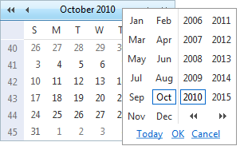

# Navigation Controls Settings

__RadCalendar__ provides a number of properties to let you customize the appearance of the [navigation controls]() that appear in the calendar title bar.

## Navigation buttons

You can enable or disable the navigation buttons in the title bar by setting the __EnableNavigation__ property. When __EnableNavigation__ is __True__ (the default), the navigation buttons appear in the title bar on either side of the [title](). When __EnableNavigation__ is __False__, the buttons do not appear on the title bar.

Each navigation button has three properties you can use to control its appearance: an image property, a text property, and a tooltip property. When the image property is set, the image is used to represent the button. The tooltip property specifies the tooltip that appears when the user hovers the mouse over the button. The following table lists these properties for each of the navigation buttons:

|  | Image property | Text property | Tooltip property | Description |
| ------ | ------ | ------ | ------ | ------ |
||NavigationPrevImage|NavigationPrevText|NavigationPrevToolTip|Move to the previous view.|
||FastNavigationPrevImage|FastNavigationPrevText|FastNavigationPrevToolTip|Move back the number of views that the __FastNavigationStep__ property specifies.|
||NavigationNextImage|NavigationNextText|NavigationNextToolTip|Move to the next view.|
||FastNavigationNextImage|FastNavigationNextText|FastNavigationNextToolTip|Move forward the number of views that the __FastNavigationStep__ property specifies.|

>note If you do not want to remove all the navigation buttons using the __EnableNavigation__ property, you can remove any of the individual navigation buttons from the title bar with a CSS rule. For example if RadCalendar has a custom CSS class of MyClass, the CSS rule for hiding the fast navigation buttons will be:
>.MyClass.rcTitlebara.rcFastPrev ,.MyClass.rcTitlebara.rcFastNext
>{
>display: none;
>}
>You should keep in mind that the correct CSS specificity (at least 31) should be used in order to override the skin's display style. The CSS classes of the four navigation buttonsare __rcFastPrev__ , __rcPrev__ , __rcNext__ and __rcFastNext__ .
>

## Month/Year popup

The month/year popup appears when the user clicks the title area of the title bar. It allows the user to change the current view by selecting a specific month and year, or to move to the view that contains the current date:

Setting the __EnableMonthYearFastNavigation__ property lets you enable or disable this popup. When __EnableMonthYearFastNavigation__ is __False__, the popup does not appear when the user clicks in the title area.

The __FastNavigationStyle__ property lets you configure the appearance of the month/year popup. For information about using style properties, see [Styles]().

The __FastNavigationSettings__ property lets you further configure the month/year popup. __FastNavigationSettings__ is a composite property, with the following sub-properties:

* __CancelButtonCaption__ specifies the caption of the Cancel button.

* __OkButtonCaption__ specifies the caption of the OK button.

* __TodayButtonCaption__ specifies the caption of the Today button.

* __EnableTodayButtonSelection__ specifies whether clicking the today button selects the current day as well as moving to the view that contains the current day.

* __DateIsOutOfRangeMessage__ specifies the text of the message that appears when the user tries to move to a date that is out of range.

>note If you set any of the __FastNavigationSettings__ sub-properties to an empty string, the month/year popup reverts to its default text value. If you set the __DateIsOutOfRangeMessage__ to an empty string, the alert that appears when the user selects a date which is out of range will be disabled.
>

>note If the navigation control is part of RadMonthYearPicker and you need to set the __Today__ , __Ok__ and __Cancel__ button captions programmaticaly, you should use a server-side event handler which executes no later than Page_Load, as the values cannot be applied correctly after that stage of the page lifecycle.
>

# See Also

 * [RadCalendar Month Navigation]()
