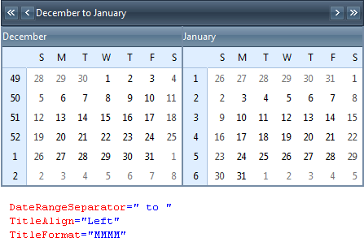

# Title Settings


You can customize the __RadCalendar__ Title to define how and what information should be shown.

## Title text

The text on the title depends on whether the calendar is in single or [multi-view mode]().

* In single-view mode, the text of the title is the formatted value of the month shown in the[day matrix](). More precisely, it is theformatted value of a DateTime object for the first day of the current month at 12:00 AM.

* In multi-view mode, the text of the title is the formatted value of the first month viewthat is showing, followed by a date range separator, followed by the formatted value of the last monthview that is showing. More precisely, it is the formatted value of a DateTime object for the first dayof the first month at 12:00 AM, followed by a date range separator, followed by the formatted value ofa DateTime object for the last day of the last month at 12:00 AM.

You can control the formatting of the dates in the title using the__TitleFormat__ and __DateRangeSeparator__ properties:

* The __TitleFormat__ property is a standard[Date format pattern](),that controls how the DateTime objects that represent the date or dates in the title are formatted.

* The __DateRangeSeparator__ property is the string that is used as adate range separator in multi-view mode.

You can control the placement of the title text in the title bar by setting the__TitleAlign__ property. __TitleAlign__ can be set to anyof the values applicable to an HTML *align* attribute, or it can be set to__NotSet__, which leaves the align attribute of the rendered HTML for the titleelement.

>note When the calendar is in multi-view mode, the __TitleAlign__ propertycontrols the alignment of the titles for each individual view as well as the alignment of the title in the title bar.
>


The following screen shots show the effects of the __TitleFormat__,__DateRangeSeparator__, and __TitleAlign__ properties:

## Title Customization

Title customization for __RadCalendar__ is achieved on per __CalendarView__ basis. And sinceno __CalendarView__ objects are exposed for design timeediting, title customization can be accomplished only programmatically.The customization should be done at any point before the __Render__ event of the page.

In order to set the title for the top calendar view, you should assign your value to __Title__ property of the __CalendarView__ object exposed by __RadCalendar__. If you have a multi-month view for your calendar, you can set the title for each child view looping through all of the child views at any point before the __Render__ event and set their titles accordingly:

>tabbedCode

````C#
	    protected void Page_Load(object sender, EventArgs e)
	    {
	        RadCalendar1.CalendarView.Title = "Title for the top view";
	        foreach (CalendarView view in RadCalendar1.CalendarView.ChildViews)
	        {
	            view.Title = "Month of " + view.GetEffectiveVisibleDate().ToString("MMMM");
	        }
	    }
````


````VB.NET
	    Protected Sub Page_Load(sender As Object, e As EventArgs) Handles Me.Load
	        RadCalendar1.CalendarView.Title = "Title for the top view"
	        For Each view As CalendarView In RadCalendar1.CalendarView.ChildViews
	            view.Title = "Month of " + view.GetEffectiveVisibleDate().ToString("MMMM")
	        Next
	    End Sub
````


>end

An alternative approach is to use the new __ChildViewRender__ event exposed by __RadCalendar__ which is fired for each child view just before it isrendered in the page response output. As such, this event constitutes the perfect place for setting the title of each child view:

>tabbedCode

````C#
	    protected void RadCalendar1_ChildViewRender(object sender, ChildViewRenderEventArgs e)
	    {
	        e.CalendarView.Title = "Month of " + e.CalendarView.GetEffectiveVisibleDate().ToString("MMMM");
	    }
````


````VB.NET
	    Protected Sub RadCalendar1_ChildViewRender(sender As Object, e As ChildViewRenderEventArgs) Handles RadCalendar1.ChildViewRender
	        e.CalendarView.Title = "Month of " + e.CalendarView.GetEffectiveVisibleDate().ToString("MMMM")
	    End Sub
````


>end

As noticed from the example code snippets above, each calendar view object exposes a method to get the first effective visible data in the month that the calendar view displays. In addition, the old property __TitleContent__ attached to eachcalendar view keeps the default title for the view. Together, both properties provide useful information to enable convenientway for title customization in any given application scenario.

## Title bar appearance

In addition to the title text, the title bar contains a set of navigation controls for changing the current view. For information on how to remove the navigation buttons or customize their appearance, see [Customizing the Navigation Controls]().

The __TitleStyle__ property affects the overall appearance of the title bar area. For details on using style properties, see [Styles]().

# See Also

 * [RadCalendar Structure]()
