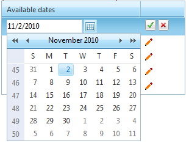

# Data Binding 


## 

Binding a __RadDatePicker__, __RadTimePicker__, __RadDateTimePicker__ or __RadMonthYearPicker__ control to a data source is easy provided you use the __DbSelectedDate__ property. It works almost like the __SelectedDate__ one, but does not throw an exception when given a null value.

When embedding __RadDatePicker__, __RadTimePicker__, __RadDateTimePicker__and __RadMonthYearPicker__ controls inside a data-bound control, use a data-binding expression to bind the value of the input control to the data source of the parent control. Data-binding expressions are contained within <%# and %> delimiters and use the __Eval__ and __Bind__ functions. The __Eval__ function is used to define one-way (read-only) binding. The __Bind__ function is used for two-way (updatable) binding.

>note In addition to calling __Eval__ and __Bind__ methods to perform data binding in a data-binding expression, you can call any publicly scoped code within the <%# and %> delimiters to execute that code and return a value during page processing.
>


The following example demonstrates how to bind a __RadDatePicker__ control inside a RadGrid, as shown above. The __RadDateTimePicker__, __RadTimePicker__ and __RadMonthYearPicker__ controls work the same way:

````ASPNET
	     
			 <telerik:RadGrid ID="RadGrid1" runat="server" AutoGenerateColumns="False" Width="300px"
	            OnNeedDataSource="RadGrid1_NeedDataSource" OnUpdateCommand="RadGrid1_UpdateCommand"
	            OnItemCreated="RadGrid1_ItemCreated">
	            <MasterTableView Width="100%" EditMode="InPlace">
	                <Columns>
	                    <telerik:GridTemplateColumn HeaderText="Available dates" UniqueName="TemplateColumn">
	                        <ItemTemplate>
	                            <asp:Label runat="server" ID="date" Text='<%# Eval("Dates", "{0:D}") %>'>
	                            </asp:Label>
	                            &nbsp;
	                        </ItemTemplate>
	                        <EditItemTemplate>
	                            <telerik:RadDatePicker ID="picker1" MinDate="2006/1/1" runat="server" DbSelectedDate='<%# Bind("Dates") %>'>
	                            </telerik:RadDatePicker>
	                        </EditItemTemplate>
	                    </telerik:GridTemplateColumn>
	                    <telerik:GridEditCommandColumn ButtonType="ImageButton" />
	                </Columns>
	            </MasterTableView>
	        </telerik:RadGrid>
````


To see the live example that the example above was taken from, see [Data Binding](http://demos.telerik.com/aspnet-ajax/Calendar/Examples/DatePicker/DataBinding/DefaultCS.aspx).

You can also bind RadTimePicker to a custom collection of time. The following Markup and code demonstrates how this can be done:

>tabbedCode

````ASPNET
	
	<h4>Binding to generic list of DateTime</h4>
	<telerik:RadTimePicker ID="RadTimePicker3" Skin="Silk" runat="server" />
	<br />
	<h4>Binding to ArrayList of DateTime</h4>
	<telerik:RadTimePicker ID="RadTimePicker4" Skin="Silk" runat="server" />
	<br />
	<h4>Binding to DateTime array</h4>
	<telerik:RadTimePicker ID="RadTimePicker5" Skin="Silk" runat="server" />
	<br />
	<h4>Binding to object array with DateTime</h4>
	<telerik:RadTimePicker ID="RadTimePicker6" Skin="Silk" runat="server" />
				
````


````C#
	    protected void Page_Load(object sender, EventArgs e)
	    {
	        List<DateTime> list = new List<DateTime>();
	        list.Add(DateTime.Now);
	        list.Add(DateTime.Now.AddHours(1));
	        list.Add(DateTime.Now.AddHours(2));
	        list.Add(DateTime.Now.AddHours(3));
	        RadTimePicker1.TimeView.DataList.DataSource = list;
	
	        ArrayList arrayList = new ArrayList();
	        arrayList.Add(DateTime.Now);
	        arrayList.Add(DateTime.Now.AddHours(1));
	        arrayList.Add(DateTime.Now.AddHours(2));
	        arrayList.Add(DateTime.Now.AddHours(3));
	        RadTimePicker2.TimeView.DataList.DataSource = arrayList;
	
	        RadTimePicker3.TimeView.DataList.DataSource = new DateTime[] { DateTime.Now, DateTime.Now.AddHours(1) };
	
	        RadTimePicker4.TimeView.DataList.DataSource = new object[] { DateTime.Now, DateTime.Now.AddHours(1) };
	    }
````


````VB.NET
	     
	    Protected Sub Page_Load(ByVal sender As Object, ByVal e As EventArgs) Handles MyBase.Load
	        Dim list As New List(Of DateTime)()
	        list.Add(DateTime.Now)
	        list.Add(DateTime.Now.AddHours(1))
	        list.Add(DateTime.Now.AddHours(2))
	        list.Add(DateTime.Now.AddHours(3))
	        RadTimePicker1.TimeView.DataList.DataSource = list
	
	        Dim arrayList As New ArrayList()
	        arrayList.Add(DateTime.Now)
	        arrayList.Add(DateTime.Now.AddHours(1))
	        arrayList.Add(DateTime.Now.AddHours(2))
	        arrayList.Add(DateTime.Now.AddHours(3))
	        RadTimePicker2.TimeView.DataList.DataSource = arrayList
	
	        RadTimePicker3.TimeView.DataList.DataSource = New DateTime() {DateTime.Now, DateTime.Now.AddHours(1)}
	
	        RadTimePicker4.TimeView.DataList.DataSource = New Object() {DateTime.Now, DateTime.Now.AddHours(1)}
	    End Sub
````


>end

To see the live example of the above see [Binding to custom collections](http://demos.telerik.com/aspnet-ajax/Calendar/Examples/DateTimePicker/CustomCollection/DefaultCS.aspx).
