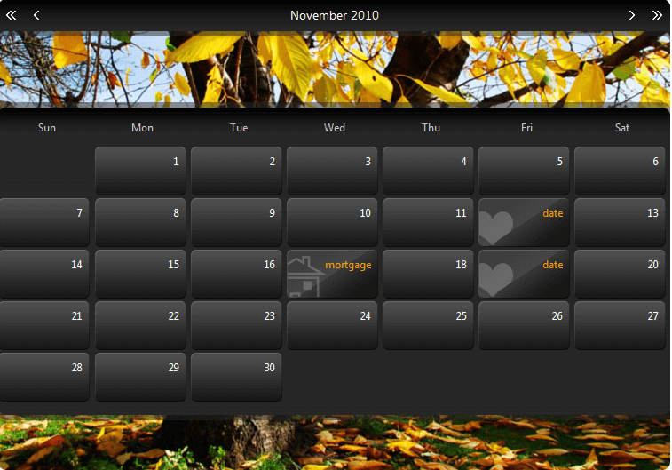

# RadCalendar Day Templates


## 

__RadCalendar__ allows you to define a collection of dynamic templates that customize the presentation of calendar days on a "per day" basis. The templates can contain regular HTML and are particularly useful if you want to implement a scheduler-like interface with extra information, such as images illustrating events, links to additional sources, etc.

The following steps describe how to implement Day Templates:

1. __Define the Dynamic Template types.__

1. Click the ellipsis button next to the __CalendarDayTemplates__ property in the properties pane. This brings up the [DayTemplate Collection Editor]().

1. In the collection editor, create individual template types for each type of day you want to customize, giving each unique ID. The following example shows the result of this step:

````ASPNET
	     
	<telerik:RadCalendar ID="RadCalendar1" runat="server" AutoPostBack="true" Skin="Special"
	       EnableEmbeddedSkins="false" EnableEmbeddedBaseStylesheet="false" EnableMonthYearFastNavigation="false" DayNameFormat="Short"
	       ShowRowHeaders="false" ShowOtherMonthsDays="false" OnDefaultViewChanged="RadCalendar1_DefaultViewChanged">
	       <CalendarDayTemplates>
	            <telerik:DayTemplate ID="DateTemplate" runat="server">
	            </telerik:DayTemplate>
	            <telerik:DayTemplate ID="MortgageTemplate" runat="server">
	            </telerik:DayTemplate>
	            <telerik:DayTemplate ID="BirthdayTemplate" runat="server">
	            </telerik:DayTemplate>
	       </CalendarDayTemplates>
	</telerik:RadCalendar>
````


1. __Create the templates.__

1. For each template type, bring up the __RadCalendar__ context menu, select __Edit Template__, and choose the template type. This brings up the [Template Design Surface]() for the template.

1. Drag controls from the toolbox onto the template design surface and set their properties to create the templates:

````ASPNET
	     
	<telerik:RadCalendar ID="RadCalendar1" runat="server" AutoPostBack="true" Skin="Special"
	       EnableEmbeddedSkins="false" EnableEmbeddedBaseStylesheet="false" EnableMonthYearFastNavigation="false" DayNameFormat="Short"
	       ShowRowHeaders="false" ShowOtherMonthsDays="false" OnDefaultViewChanged="RadCalendar1_DefaultViewChanged">
	        <CalendarDayTemplates>
	             <telerik:DayTemplate ID="DateTemplate" runat="server">
	                 <Content>
	                   <div class="rcTemplate rcDayDate">
	                       date
	                   </div>
	                 </Content>
	             </telerik:DayTemplate>
	             <telerik:DayTemplate ID="MortgageTemplate" runat="server">
	                 <Content>
	                   <div class="rcTemplate rcDayMortgage">
	                       mortgage
	                   </div>
	                 </Content>
	             </telerik:DayTemplate>
	             <telerik:DayTemplate ID="BirthdayTemplate" runat="server">
	                 <Content>
	                     <div class="rcTemplate rcDayBirthday">
	                       birthday
	                     </div>
	                 </Content>
	             </telerik:DayTemplate>
	        </CalendarDayTemplates>
	</telerik:RadCalendar>
````


1. __Add Special Days to the calendar and assign the templates.__

1. You can define the special days at design time using the [RadCalendarDay Collection Editor](). For each special day you add, in addition to any other properties, set the __TemplateID__ property to the ID of the template you want to assign to that special day:

````ASPNET
	     
	<telerik:RadCalendar ID="RadCalendar1" runat="server" AutoPostBack="true" Skin="Special"
	       EnableEmbeddedSkins="false" EnableEmbeddedBaseStylesheet="false" EnableMonthYearFastNavigation="false" DayNameFormat="Short"
	       ShowRowHeaders="false" ShowOtherMonthsDays="false" OnDefaultViewChanged="RadCalendar1_DefaultViewChanged">
	       <SpecialDays>
	           <telerik:RadCalendarDay Date="2010/06/12" Repeatable="DayInMonth" TemplateID="DateTemplate" />
	           <telerik:RadCalendarDay Date="2010/06/19" Repeatable="DayInMonth" TemplateID="DateTemplate" />
	           <telerik:RadCalendarDay Date="2010/06/17" Repeatable="DayInMonth" TemplateID="MortgageTemplate" />
	           <telerik:RadCalendarDay Date="2010/06/8" Repeatable="DayAndMonth" TemplateID="BirthdayTemplate" />
	           <telerik:RadCalendarDay Date="2010/08/7" Repeatable="DayAndMonth" TemplateID="BirthdayTemplate" />
	           <telerik:RadCalendarDay Date="2010/10/8" Repeatable="DayAndMonth" TemplateID="BirthdayTemplate" />
	           <telerik:RadCalendarDay Date="2010/12/23" Repeatable="DayAndMonth" TemplateID="BirthdayTemplate" />
	           <telerik:RadCalendarDay Date="2010/2/14" Repeatable="DayAndMonth" TemplateID="BirthdayTemplate" />
	       </SpecialDays>
	       <CalendarDayTemplates>
	            <telerik:DayTemplate ID="DateTemplate" runat="server">
	                <Content>
	                     <div class="rcTemplate rcDayDate">
	                          date
	                     </div>
	                </Content>
	            </telerik:DayTemplate>
	            <telerik:DayTemplate ID="MortgageTemplate" runat="server">
	                <Content>
	                     <div class="rcTemplate rcDayMortgage">
	                       mortgage
	                     </div>
	                </Content>
	            </telerik:DayTemplate>
	            <telerik:DayTemplate ID="BirthdayTemplate" runat="server">
	                <Content>
	                     <div class="rcTemplate rcDayBirthday">
	                       birthday
	                     </div>
	                </Content>
	            </telerik:DayTemplate>
	       </CalendarDayTemplates>
	 </telerik:RadCalendar>
````


1. You can also add special days dynamically at runtime:

>note Note that the best approach for adding days to the __SpecialDays__ collection is on __Page_Load__ event. Also if the special days should persist not only in the current view but in other month views the __AutoPostBack__ property of the RadCalendar should be set to __true__ .
>


````C#
	
	
	    protected void Page_Load(object sender, EventArgs e)
	    {
	        if (!IsPostBack)
	        {
	            RadCalendarDay NewDay = new RadCalendarDay(RadCalendar1);
	            NewDay.Date = new DateTime(2010, 11, 12);
	            NewDay.Repeatable = RecurringEvents.DayAndMonth;
	            NewDay.TemplateID = "BirthdayTemplate";
	            NewDay.ToolTip = "Anne's Birthday";
	            RadCalendar1.SpecialDays.Add(NewDay);
	        }
	    }
				
````
````VB.NET
	     
	
	    Protected Sub Page_Load(ByVal sender As Object, ByVal e As EventArgs) Handles Me.Load
	        If Not IsPostBack Then
	            Dim NewDay As New RadCalendarDay(RadCalendar1)
	            NewDay.Date = New DateTime(2010, 11, 12)
	            NewDay.Repeatable = RecurringEvents.DayAndMonth
	            NewDay.TemplateID = "BirthdayTemplate"
	            NewDay.ToolTip = "Anne's Birthday"
	            RadCalendar1.SpecialDays.Add(NewDay)
	        End If
	    End Sub
				
````


>note You can add special days to a calendar without using templates. You can use their __ItemStyle__ property to make them visually distinct.
>

