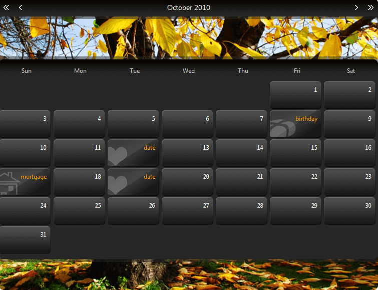

# RadCalendar Header and Footer Templates


## 

The header and footer areas of a **RadCalendar** control can be customized using templates. The header is the area between the title and the main calendar area, while the footer is the area below the main calendar area.

As with all **RadCalendar** templates, the header and footer templates can contain regular HTML, including text, images, hyperlinks, and so on.

To create templates for the header and footer, right click on the RadCalendar control and choose **Edit Template | CalendarHeader** or **Edit Template | CalendarFooter**. This brings up the template design surface, where you can drag and drop items from the tool box.

The following code shows a **RadCalendar** definition with header and footer template definitions:

````ASPNET
	     
	<telerik:RadCalendar id="RadCalendar1" runat="server">
	    <HeaderTemplate>
	        <asp:Image id="HeaderImage" runat="server" Width="100%" ImageUrl="Images/spring_header.gif"></asp:Image>
	    </HeaderTemplate>
	    <FooterTemplate>
	        <asp:Image id="FooterImage" runat="server" Width="100%" ImageUrl="Images/spring_footer.gif"></asp:Image>
	    </FooterTemplate>
	</telerik:RadCalendar>
````


# See Also

 * [Template Design Surface]()
