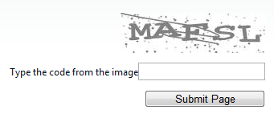

# Right-to-left Support

The **RadCaptcha** fully supports right-to-left (RTL) language locales. In order to turn on the RTL support you should set **dir=rtl to the html or body** element or at least to its parent element. You can also use the **direction:rtl** CSS property.

````ASP.NET
<div dir="rtl">
	<telerik:RadCaptcha ID="RadCaptcha1" runat="server" ErrorMessage="Page not valid. The code you entered is not valid"
		ValidationGroup="Group">
	</telerik:RadCaptcha>
	<asp:Button ID="btnVerify" runat="server" Text="Submit Page" Width="150px" ValidationGroup="Group" />
</div>
````



# See Also

 * [See this live in an online demo](https://demos.telerik.com/aspnet-ajax/colorpicker/examples/righttoleft/defaultcs.aspx)
