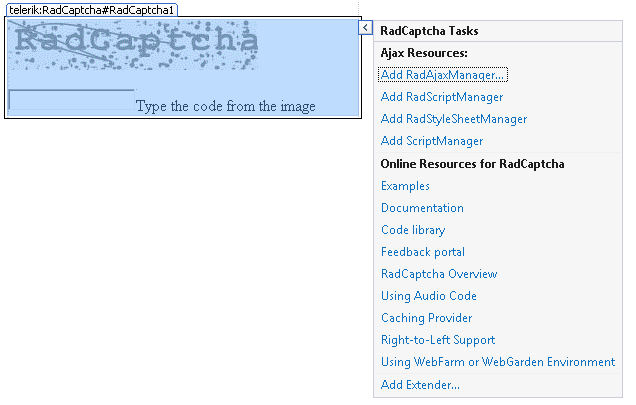

# Design Time

The Smart Tag of __RadCaptcha__ lets you easily enable the httpHandler for your control or quickly get help. You can display the Smart Tag by right clicking on a __RadCaptcha__ control and choosing "Show Smart Tag", or clicking the small rightward-pointing arrow located in the upper right corner of the control.
>caption 

## Enable RadCaptcha Http Handler

Enables the RadCaptcha httpHandler. Click OK to close the confirmation dialog for the RadCaptcha handler.

## Ajax Resources

* __Add RadAjaxManager...__ adds a __RadAjaxManager__ component to your Web page, and displays the __r.a.d.ajax Property Builder__ where you can configure it.

* __Replace ScriptManager with RadScriptManager__ replaces the default __ScriptManager__ component that is added for AJAX-enabled Web sites with __RadScriptManager__.

* Add __RadStyleSheetManager__ adds a __RadStyleSheetManager__ to your Web page.

## Learning Center

* Links navigate you directly to examples, help, and code library.

* You can navigate directly to the [Telerik Support Center](http://www.telerik.com/support/home.aspx).
